# Core BUETians

A full-stack social media platform for BUET students, built with a Django REST + Channels backend and a React (Vite) frontend.

## Project Overview

Core BUETians includes:

- User authentication and profile management
- Social feed with posts, comments, likes, and hashtags
- Real-time chat (WebSocket)
- Groups and community interactions
- Marketplace for student products
- Forums for blood requests and tuition posts
- Notifications and global search

## Tech Stack

### Backend (`/BACKEND`)

- Python, Django 4.2, Django REST Framework
- Django Channels + Daphne (WebSocket support)
- JWT authentication (`djangorestframework_simplejwt`)
- PostgreSQL (configured in `settings.py`)
- Swagger/ReDoc via `drf-yasg`

### Frontend (`/FRONTEND`)

- React 18 + Vite
- Axios, React Router, React Toastify, React Icons
- Proxy setup for API (`/api`), media (`/media`), and WebSocket (`/ws`)

## Project Structure

```text
CSB/
├── BACKEND/   # Django REST + Channels server
├── FRONTEND/  # React Vite client
└── docs/
    └── screenshots/
```

## Screenshots

Add your screenshots in `docs/screenshots/` and keep the filenames used below.

### Home Page

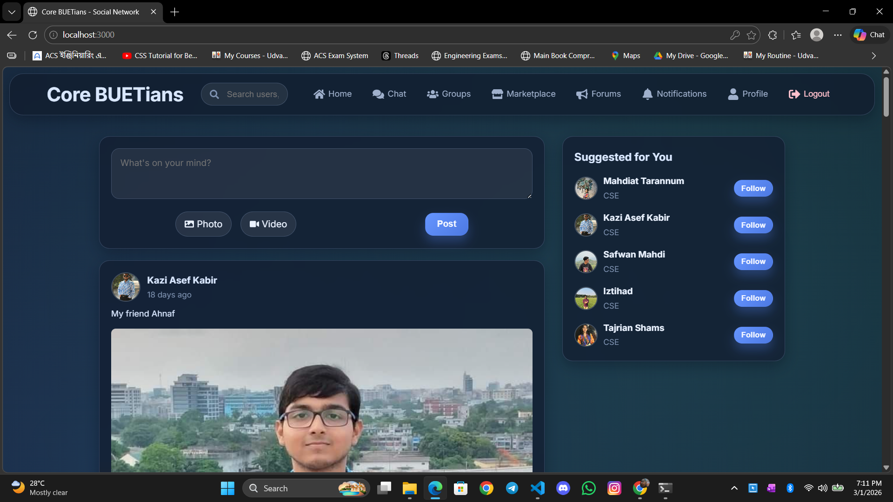

### Authentication

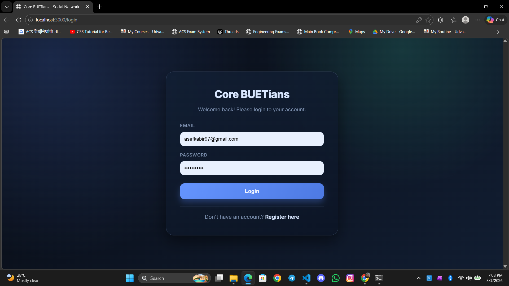
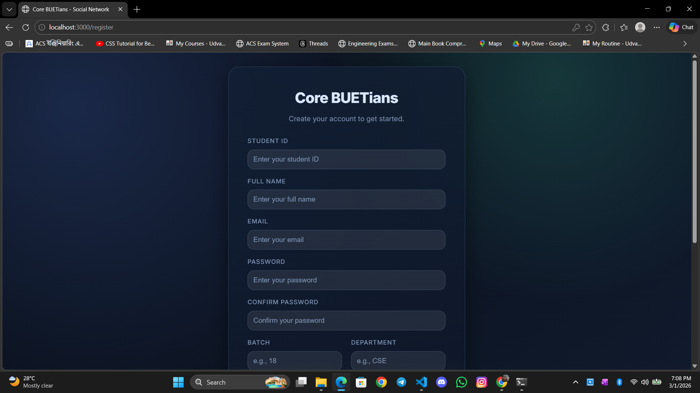

### Profile

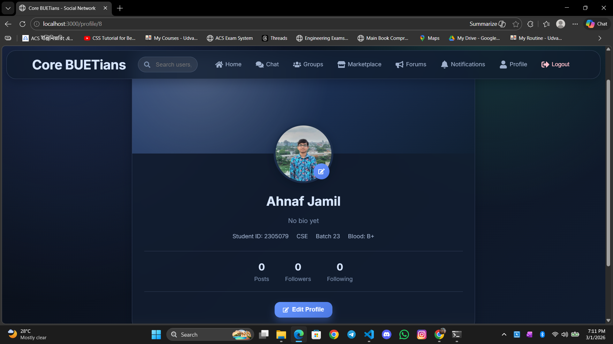

### Search

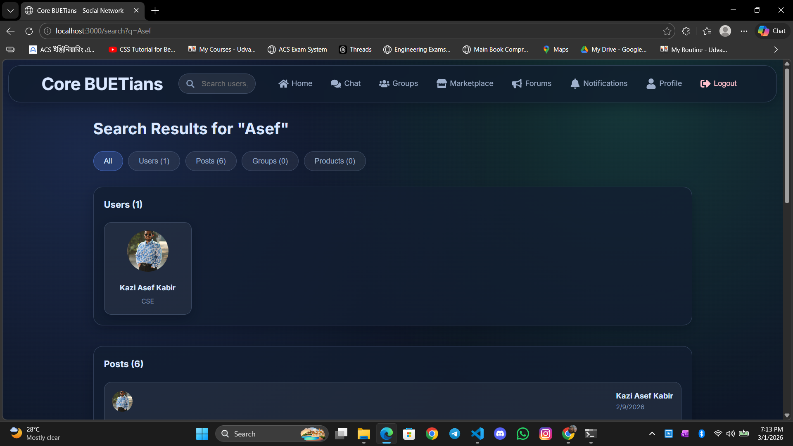

### Chat

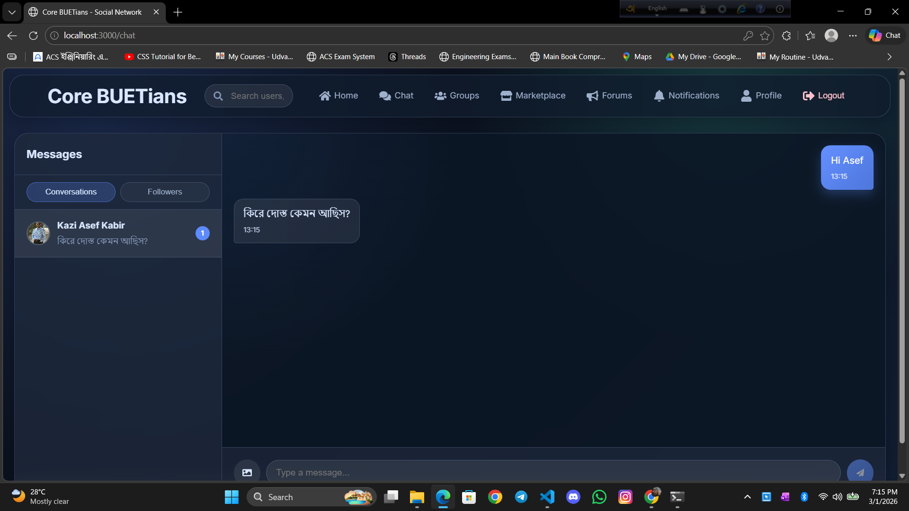

### Group

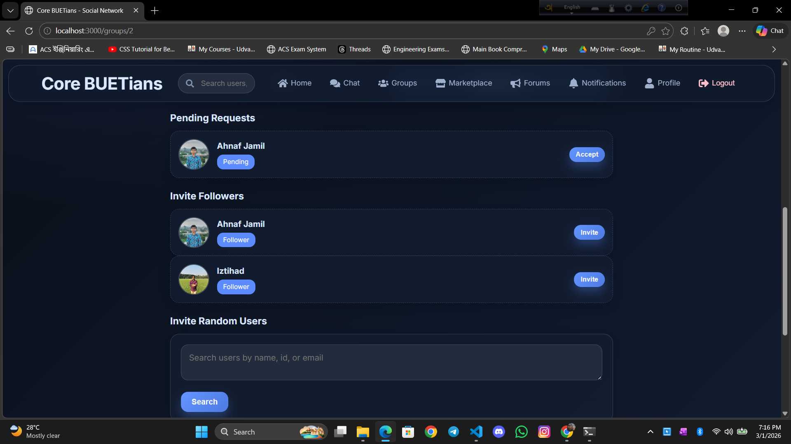
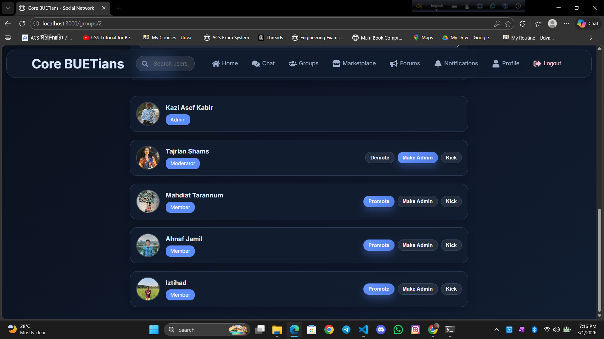

### Forum

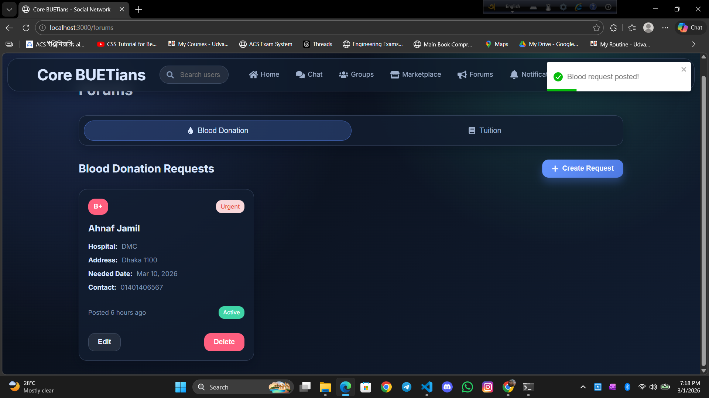
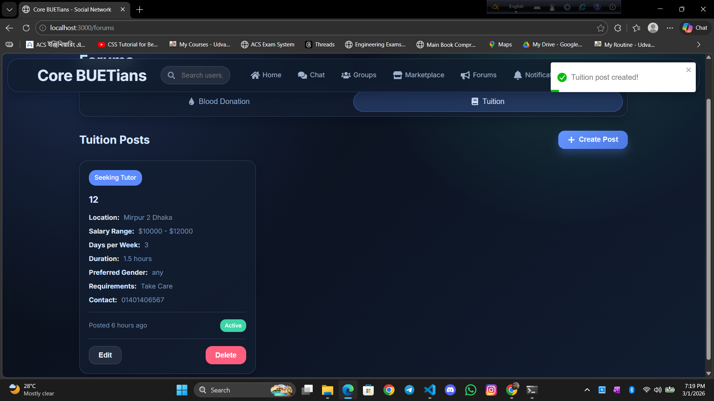

### Notifications

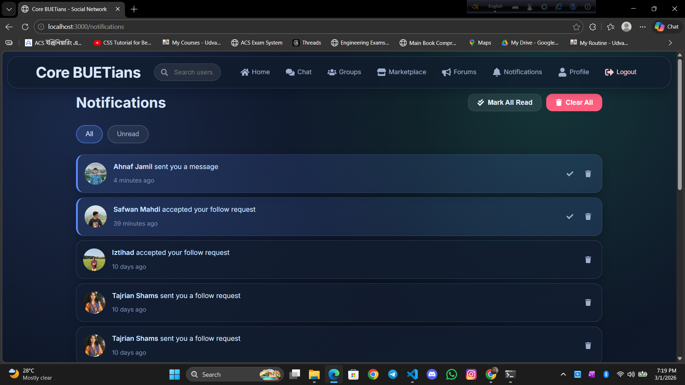

> If images do not appear, add matching files in `docs/screenshots/`:
> `Home_Page.png`, `Login.png`, `Registration.png`, `Profile.png`, `Search.png`, `Chat.png`, `Group_Join.png`, `Group_Member.png`, `Blood_Donation.png`, `Tution_Post.png`, `Notification.png`.

## Prerequisites

Install the following before running locally:

- Python 3.10+
- Node.js 20+
- PostgreSQL 14+ (or compatible)
- Git

## Local Setup and Installation

### 1) Clone the repository

```bash
git clone <your-repo-url>
cd CSB
```

### 2) Backend setup (Django)

```powershell
cd BACKEND
python -m venv .venv
.\.venv\Scripts\Activate.ps1
pip install -r requirements.txt
```

Create a `.env` file inside `BACKEND/`:

```env
DB_NAME=your_database_name
DB_USER=your_database_user
DB_PASSWORD=your_database_password
DB_HOST=localhost
DB_PORT=5432
```

Apply migrations and start backend:

```powershell
python manage.py migrate
python manage.py runserver 8000
```

Optional (admin access):

```powershell
python manage.py createsuperuser
```

Backend runs at: `http://localhost:8000`

API docs:

- Swagger: `http://localhost:8000/swagger/`
- ReDoc: `http://localhost:8000/redoc/`

WebSocket endpoint:

- `ws://localhost:8000/ws/chat/`

### 3) Frontend setup (React + Vite)

Open a new terminal:

```powershell
cd FRONTEND
npm install
npm run dev
```

Frontend runs at: `http://localhost:3000`

> Vite config is set to proxy requests to backend on `http://localhost:8000`.

## Running the Full Project Locally

Use two terminals:

- Terminal 1: run backend (`python manage.py runserver 8000`) inside `BACKEND`
- Terminal 2: run frontend (`npm run dev`) inside `FRONTEND`

Then open `http://localhost:3000` in your browser.

## Main API Route Groups

- `/api/users/`
- `/api/posts/`
- `/api/chat/`
- `/api/groups/`
- `/api/marketplace/`
- `/api/forums/`
- `/api/notifications/`
- `/api/search/`

## Notes

- Backend currently uses PostgreSQL settings via environment variables in `core_buetians/settings.py`.
- `db.sqlite3` exists in the repo, but default runtime configuration points to PostgreSQL.
- CORS is enabled for common local frontend hosts.

## License

This project is licensed under the MIT License. See the [LICENSE](LICENSE) file for details.
