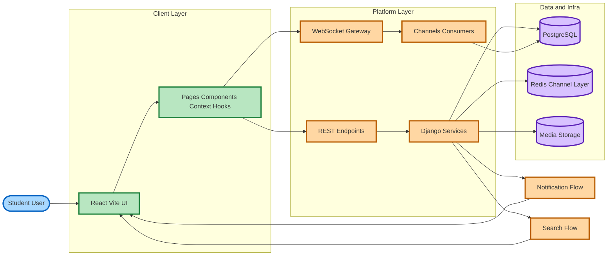
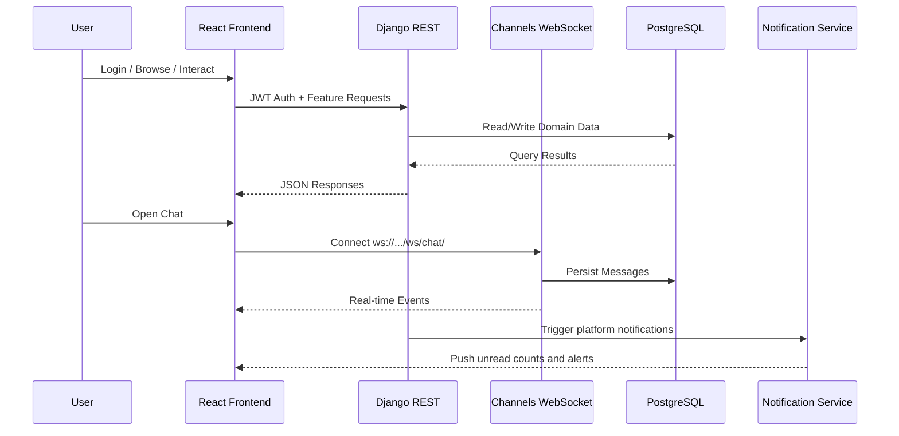
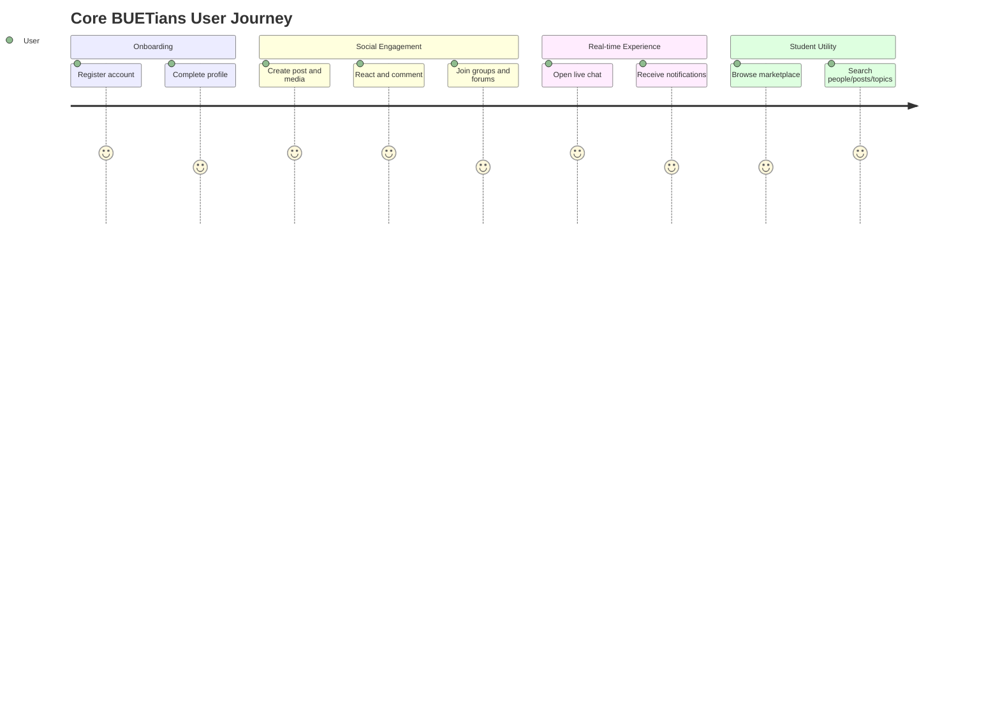

# Core BUETians

<div align="center">


Industry-style full-stack social platform for BUET students with modular backend domains, real-time communication, and scalable feature boundaries.

</div>

## Executive Summary

Core BUETians is a domain-driven social platform that combines:

- High-engagement social feed (posts, likes, comments, hashtags)
- Real-time chat with WebSocket transport
- Communities (groups + forums)
- Student marketplace workflows
- Notification and search-driven discovery

The project is organized to support maintainable growth: each core business area is separated into its own Django app, while the frontend is componentized under React + Vite.

## Animated Product Workflow

The Mermaid diagrams below render dynamically on GitHub and are styled to present a polished, industry-ready system narrative.







## Core Functionalities

- Authentication and profile lifecycle
- Social posting, comments, reactions, feed visibility
- Real-time one-to-one or threaded communication
- Group communities and group interactions
- Forum posting for focused community topics
- Marketplace listing and interactions
- Notification orchestration across modules
- Cross-module search routing

## Engineering Specialities

- Domain modularity: isolated Django apps for independent feature evolution
- API-first architecture: clear backend route groups for integration readiness
- Real-time capability: Channels + Daphne for low-latency chat events
- Media-ready design: structured media directories for upload domains
- SQL asset organization: dedicated schema/functions/procedures/triggers folders
- Frontend/backend decoupling: Vite client with proxy-based local integration

## Architecture Overview

### Backend Stack

- Django 4.2 + Django REST Framework
- Django Channels + Daphne
- JWT auth via `djangorestframework_simplejwt`
- PostgreSQL driver via `psycopg2-binary`
- API documentation via `drf-yasg` (Swagger/ReDoc)
- Redis channel layer support via `channels-redis`

### Frontend Stack

- React 18 + Vite
- Axios for HTTP integration
- React Router for route-level composition
- React Toastify for user feedback
- React Icons for visual consistency

## Professional Repository Structure

```text
CSB/
├── BACKEND/
│   ├── core_buetians/        # Global settings, root routing, ASGI/WSGI
│   ├── users/                # Auth, profiles, user domain
│   ├── posts/                # Feed and engagement domain
│   ├── chat/                 # Real-time messaging domain
│   ├── groups/               # Community group domain
│   ├── forums/               # Topic-focused forum domain
│   ├── marketplace/          # Listings and marketplace domain
│   ├── notification/         # Notification domain
│   ├── sql/                  # DB schema, functions, triggers, procedures
│   ├── utils/                # Shared auth/db/pagination/permission utilities
│   └── media/                # Uploaded media by feature category
├── FRONTEND/
│   ├── src/components/       # Reusable UI building blocks
│   ├── src/pages/            # Screen-level modules
│   ├── src/services/         # API communication layer
│   ├── src/context/          # Shared state providers
│   ├── src/hooks/            # Custom hooks
│   ├── src/styles/           # Styling system
│   └── src/utils/            # Frontend helper utilities
├── docs/
│   └── screenshots/          # Product snapshots
└── run_fullstack.py          # One-command local startup helper
```

## API Surface (Domain Routes)

- `/api/users/`
- `/api/posts/`
- `/api/chat/`
- `/api/groups/`
- `/api/marketplace/`
- `/api/forums/`
- `/api/notifications/`
- `/api/search/`

## Local Development Setup

### Prerequisites

- Python 3.10+
- Node.js 20+
- PostgreSQL 14+
- Git

### 1. Backend Bootstrapping

```powershell
cd BACKEND
python -m venv .venv
.\.venv\Scripts\Activate.ps1
pip install -r requirements.txt
```

Create `BACKEND/.env`:

```env
DB_NAME=your_database_name
DB_USER=your_database_user
DB_PASSWORD=your_database_password
DB_HOST=localhost
DB_PORT=5432
```

Run backend:

```powershell
python manage.py migrate
python manage.py runserver 8000
```

Optional:

```powershell
python manage.py createsuperuser
```

### 2. Frontend Bootstrapping

```powershell
cd FRONTEND
npm install
npm run dev
```

### 3. One-Command Full Stack Run

```powershell
python run_fullstack.py
```

## Runtime Endpoints

- Frontend: `http://localhost:3000`
- Backend API: `http://localhost:8000`
- Swagger: `http://localhost:8000/swagger/`
- ReDoc: `http://localhost:8000/redoc/`
- WebSocket chat: `ws://localhost:8000/ws/chat/`

## Industry-Ready Positioning

This project is structured to be presentation-ready for professional audiences:

- Clear separation of concerns across backend business domains
- Discoverable API boundaries for team-scale collaboration
- Real-time and REST layers coexisting in one coherent platform
- Organized SQL + infrastructure-friendly backend assets
- Frontend architecture that supports iterative product growth

## Notes

- Runtime database target is PostgreSQL through environment configuration.
- `BACKEND/db.sqlite3` exists in the repository, but deployment-grade usage should remain PostgreSQL.
- CORS and proxy patterns are configured for local full-stack development.

## License

Distributed under the MIT License. See [LICENSE](LICENSE) for details.
