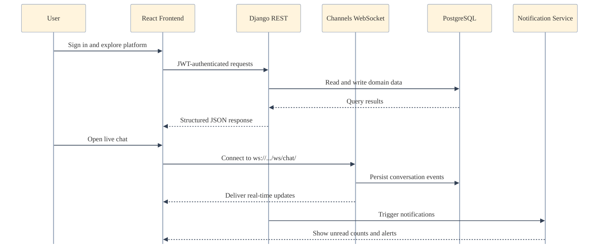
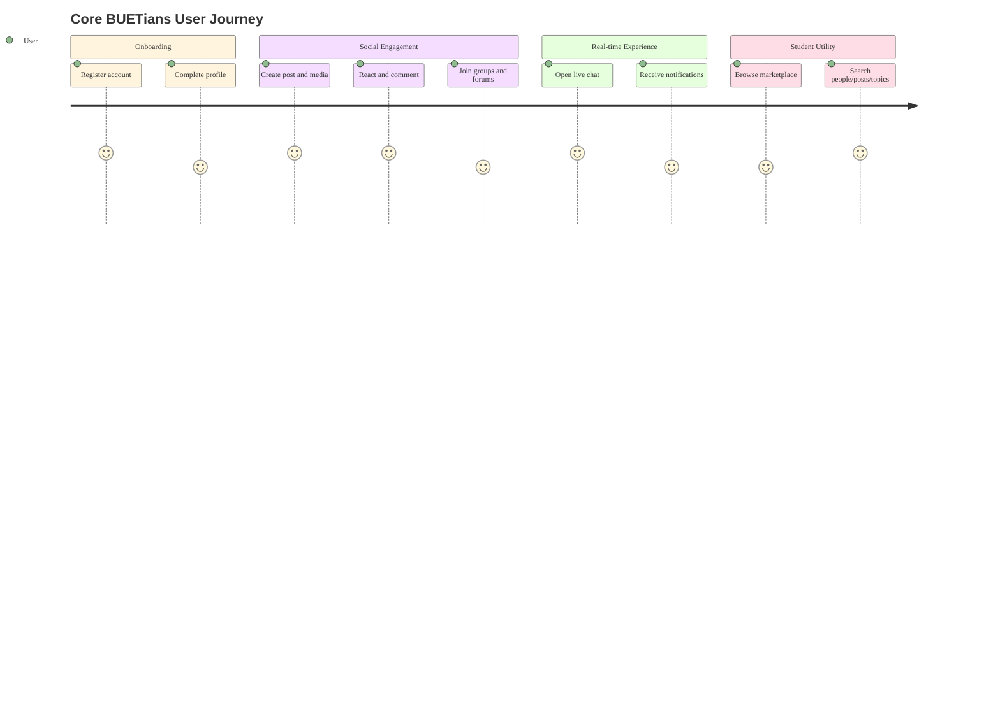
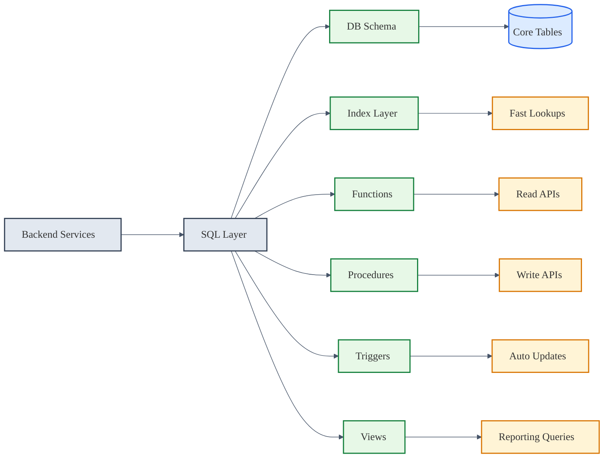
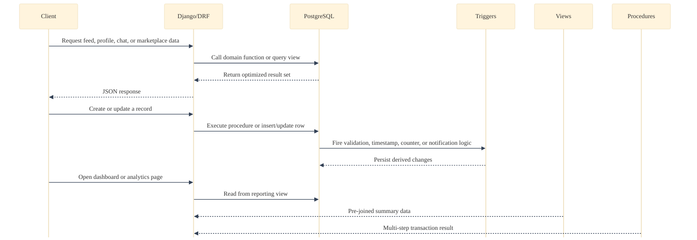
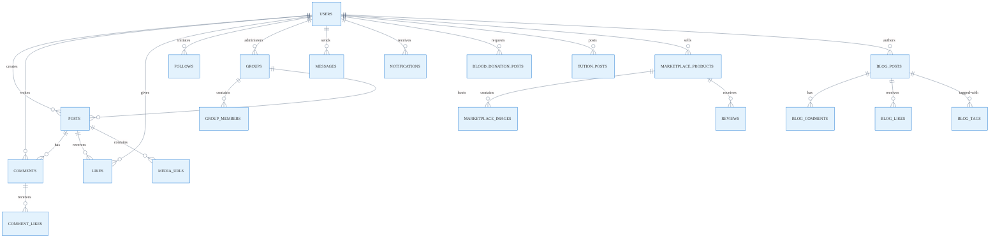

# Core BUETians

<div align="center">


Industry-style full-stack social platform for BUET students with modular backend domains, real-time communication, and scalable feature boundaries.

</div>

## Executive Summary

Core BUETians is a domain-driven social platform that combines:

- High-engagement social feed (posts, likes, comments, hashtags)
- Real-time chat with WebSocket transport
- Communities (groups + forums)
- Student marketplace workflows
- Notification and search-driven discovery

The project is organized to support maintainable growth: each core business area is separated into its own Django app, while the frontend is componentized under React + Vite.

## Project Demo


https://github.com/user-attachments/assets/6ac016ff-ade8-4872-86e9-911d4b8a5ae4


## Animated Product Workflow

The Mermaid diagrams below render dynamically on GitHub and are styled to present a polished, industry-ready system narrative.






## Core Functionalities

- Authentication and profile lifecycle
- Social posting, comments, reactions, feed visibility
- Real-time one-to-one or threaded communication
- Group communities and group interactions
- Forum posting for focused community topics
- Marketplace listing and interactions
- Notification orchestration across modules
- Cross-module search routing

## Engineering Specialities

- Domain modularity: isolated Django apps for independent feature evolution
- API-first architecture: clear backend route groups for integration readiness
- Real-time capability: Channels + Daphne for low-latency chat events
- Media-ready design: structured media directories for upload domains
- SQL asset organization: dedicated schema/functions/procedures/triggers folders
- Frontend/backend decoupling: Vite client with proxy-based local integration

## Database Workflows

The database layer is intentionally split into schema, indexes, views, functions, procedures, and triggers so each concern stays visible and maintainable. The diagrams below show how read, write, and automation paths move through PostgreSQL.





### SQL Layer Breakdown

- `BACKEND/sql/DB_SCHEMA.sql` defines the core tables and relationships.
- `BACKEND/sql/indexes.sql` speeds up common lookups, feed sorting, search, and notification retrieval.
- `BACKEND/sql/views/views.sql` exposes reporting and read-optimized projections such as activity, trending, and summary datasets.
- `BACKEND/sql/functions/*.sql` contains reusable query logic for users, posts, groups, marketplace, forums, chat, and notifications.
- `BACKEND/sql/procedures/procedures.sql` wraps multi-step operations such as creating content with related rows, toggling reactions, and confirming marketplace flows.
- `BACKEND/sql/triggers/triggers.sql` keeps timestamps, counters, validation, cleanup, and notification side effects in sync automatically.

### How The Pieces Work

- Functions handle repeatable read paths and return structured data for API endpoints.
- Indexes reduce scan cost for the most common filters, joins, and sorting patterns.
- Views consolidate multi-table reads into stable reporting surfaces.
- Triggers enforce automatic maintenance when rows change.
- Procedures group multiple statements into one transactional operation.

---

## Detailed Database Workflows

### Core Tables and Workflows

#### **Data Model Visualization**



#### **Users Table**
- **Purpose**: Store user profiles, authentication data, and metadata.
- **Workflow**: 
  - User registers → row inserted → `set_user_defaults` trigger fires → sets `is_active = TRUE` if null
  - User profile updated → `update_users_timestamp` trigger fires → auto-updates `updated_at`
  - User deleted → `cleanup_user_data` trigger fires → deletes notifications, anonymizes messages
- **Related Operations**: Authentication, profile lookup by email/student_id, department/batch filtering.

#### **Posts Table**
- **Purpose**: Store user-generated posts with visibility and media type metadata.
- **Workflow**:
  - User creates post → row inserted → `update_posts_timestamp` fires → timestamp set
  - Like added to post → `increment_post_likes_count` trigger fires → `likes_count++`
  - Comment added to post → `increment_post_comments_count` trigger fires → `comments_count++`
  - Post deleted → `cleanup_post_data` trigger fires → deletes related notifications
- **Related Operations**: Feed generation (public/followers/private), visibility filtering, trending calculations.

#### **Comments Table**
- **Purpose**: Store comments and nested replies on posts.
- **Workflow**:
  - Comment inserted → `after_insert_comment` and `create_comment_notification` fire → counter incremented, notification created
  - Comment deleted → `after_delete_comment` fires → counter decremented
  - Parent comment referenced → nested reply relationship maintained via `comment_id` foreign key
- **Related Operations**: Comment threading, reply notifications, depth-aware retrieval.

#### **Likes Table**
- **Purpose**: Track post reactions from users (one row per user-post pair).
- **Workflow**:
  - Like inserted → `after_insert_like` and `create_like_notification` fire → post counter incremented, actor notified
  - Like deleted → `after_delete_like` fires → post counter decremented
  - Query for user's liked posts → indexed lookup returns results quickly
- **Related Operations**: Toggle like/unlike, liked feed, engagement scoring.

#### **Follows Table**
- **Purpose**: Track follower relationships with status (pending/accepted/rejected).
- **Workflow**:
  - Follow request created (status=pending) → `create_follow_notification` fires → notify receiver
  - Follow accepted (status→accepted) → `create_follow_notification` fires → notify sender
  - Before any follow insert → `validate_follow` trigger fires → rejects self-follows
- **Related Operations**: Profile followers, follow suggestions, access control for private posts.

#### **Groups Table**
- **Purpose**: Store group/community metadata and admin ownership.
- **Workflow**:
  - Group created → row inserted → `update_groups_timestamp` fires
  - Group cover image updated → `update_groups_timestamp` fires
- **Related Operations**: Group discovery, admin permissions, privacy filtering.

#### **Group Members Table**
- **Purpose**: Track membership status, role (member/admin/moderator), and join requests.
- **Workflow**:
  - User requests to join (status=pending) → `create_group_join_request_notification` fires → admin notified once
  - Join accepted (status→accepted) → role assigned (member/admin/moderator)
  - Member removed → cascading delete triggered
- **Related Operations**: Access control, role-based permissions, member listings.

#### **Marketplace Products Table**
- **Purpose**: Store product listings with status (available/sold/reserved).
- **Workflow**:
  - Product created → row inserted → seller_id indexed, status=available
  - Product sold (status→sold) → `update_marketplace_timestamp` fires, buyer cannot edit
  - Product updated → `update_marketplace_timestamp` fires
- **Related Operations**: Product discovery by category/condition/price, seller reputation.

#### **Marketplace Product Images Table**
- **Purpose**: Store multiple images per product via one-to-many relationship.
- **Workflow**:
  - Image inserted during product creation via `create_product_with_images` procedure
  - Product deleted → cascade deletes all images
  - Query product images → indexed by `product_id` for fast retrieval
- **Related Operations**: Product gallery, media carousel.

#### **Messages Table**
- **Purpose**: Store chat messages between users with read flag and optional product context.
- **Workflow**:
  - Message sent → `create_message_notification` trigger fires → receiver notified
  - Message marked read (is_read=true) → no trigger (manual API call)
  - Query conversation → indexed by (sender, receiver, created_at DESC) for fast retrieval
- **Related Operations**: Chat history, unread counts, conversation threading.

#### **Notifications Table**
- **Purpose**: Track all user notifications (likes, comments, follows, messages, group invites, blog alerts).
- **Workflow**:
  - Any trigger fire (like, comment, follow, message, etc.) → row inserted into notifications
  - User views notification → `is_read = TRUE` set via API
  - `mark_all_notifications_read()` function called → bulk mark all user's notifications as read
- **Related Operations**: Notification feed, unread badge, notification preferences.

#### **Blog Posts Table**
- **Purpose**: Store published and draft blog articles with scheduled publish support.
- **Workflow**:
  - Blog created (via `create_blog_post_with_tags` procedure) → row inserted, tags inserted separately
  - Blog updated (via `update_blog_post_with_tags` procedure) → content updated, tags recreated
  - Blog published (is_published=true, published_at set) → `update_blog_timestamp` fires
- **Related Operations**: Blog listing, draft/published filtering, author's blog history.

#### **Blog Comments Table**
- **Purpose**: Store comments on blog posts with optional parent comment for threading.
- **Workflow**:
  - Comment added (via `add_blog_comment_with_notification` procedure) → row inserted, notification fired
  - Blog comment deleted → cascade deletes child comments
  - Comment retrieved → indexed by (blog_id, created_at DESC)
- **Related Operations**: Comment threads, nested reply display.

#### **Blog Likes Table**
- **Purpose**: Track blog reactions (one row per user-blog pair).
- **Workflow**:
  - Like inserted → `increment_blog_likes_count` trigger fires → blog counter incremented
  - Like deleted → `decrement_blog_likes_count` trigger fires → blog counter decremented
  - Notification fired → blog author notified of like
- **Related Operations**: Like toggle, liked blog feed, blog popularity.

#### **Blood Donation Posts Table**
- **Purpose**: Store urgent and non-urgent blood donation requests.
- **Workflow**:
  - Request created → indexed by (blood_group, urgency, status, needed_date)
  - Request updated (status: active/fulfilled/cancelled) → `update_blood_donation_timestamp` fires
  - Urgent request active → indexed and featured in search/discovery
- **Related Operations**: Blood search by group and location, urgent filtering, request history.

#### **Tuition Posts Table**
- **Purpose**: Store seeking/offering tuition posts with salary and subject metadata.
- **Workflow**:
  - Tuition post created (via `create_tuition_post_with_subjects` procedure) → post and subjects inserted
  - Post updated (via `update_tuition_post_with_subjects` procedure) → post updated, subjects replaced
  - Search by subject → joined via `tution_post_subjects` table
- **Related Operations**: Tuition discovery by subject, salary filtering, active post listings.

---


## Architecture Overview

### Backend Stack

- Django 4.2 + Django REST Framework
- Django Channels + Daphne
- JWT auth via `djangorestframework_simplejwt`
- PostgreSQL driver via `psycopg2-binary`
- API documentation via `drf-yasg` (Swagger/ReDoc)
- Redis channel layer support via `channels-redis`

### Frontend Stack

- React 18 + Vite
- Axios for HTTP integration
- React Router for route-level composition
- React Toastify for user feedback
- React Icons for visual consistency

## Professional Repository Structure

```text
CSB/
├── BACKEND/
│   ├── core_buetians/        # Global settings, root routing, ASGI/WSGI
│   ├── users/                # Auth, profiles, user domain
│   ├── posts/                # Feed and engagement domain
│   ├── chat/                 # Real-time messaging domain
│   ├── groups/               # Community group domain
│   ├── forums/               # Topic-focused forum domain
│   ├── marketplace/          # Listings and marketplace domain
│   ├── notification/         # Notification domain
│   ├── sql/                  # DB schema, functions, triggers, procedures
│   ├── utils/                # Shared auth/db/pagination/permission utilities
│   └── media/                # Uploaded media by feature category
├── FRONTEND/
│   ├── src/components/       # Reusable UI building blocks
│   ├── src/pages/            # Screen-level modules
│   ├── src/services/         # API communication layer
│   ├── src/context/          # Shared state providers
│   ├── src/hooks/            # Custom hooks
│   ├── src/styles/           # Styling system
│   └── src/utils/            # Frontend helper utilities
├── docs/
│   └── screenshots/          # Product snapshots
└── run_fullstack.py          # One-command local startup helper
```

## API Surface (Domain Routes)

- `/api/users/`
- `/api/posts/`
- `/api/chat/`
- `/api/groups/`
- `/api/marketplace/`
- `/api/forums/`
- `/api/notifications/`
- `/api/search/`

## Local Development Setup

### Prerequisites

- Python 3.10+
- Node.js 20+
- PostgreSQL 14+
- Git

### 1. Backend Bootstrapping

```powershell
cd BACKEND
python -m venv .venv
.\.venv\Scripts\Activate.ps1
pip install -r requirements.txt
```

Create `BACKEND/.env`:

```env
DB_NAME=your_database_name
DB_USER=your_database_user
DB_PASSWORD=your_database_password
DB_HOST=localhost
DB_PORT=5432
```

Run backend:

```powershell
python manage.py migrate
python manage.py runserver 8000
```

Optional:

```powershell
python manage.py createsuperuser
```

### 2. Frontend Bootstrapping

```powershell
cd FRONTEND
npm install
npm run dev
```

### 3. One-Command Full Stack Run

```powershell
python run_fullstack.py
```

## Runtime Endpoints

- Frontend: `http://localhost:3000`
- Backend API: `http://localhost:8000`
- Swagger: `http://localhost:8000/swagger/`
- ReDoc: `http://localhost:8000/redoc/`
- WebSocket chat: `ws://localhost:8000/ws/chat/`

## Industry-Ready Positioning

This project is structured to be presentation-ready for professional audiences:

- Clear separation of concerns across backend business domains
- Discoverable API boundaries for team-scale collaboration
- Real-time and REST layers coexisting in one coherent platform
- Organized SQL + infrastructure-friendly backend assets
- Frontend architecture that supports iterative product growth

## Notes

- Runtime database target is PostgreSQL through environment configuration.
- `BACKEND/db.sqlite3` exists in the repository, but deployment-grade usage should remain PostgreSQL.
- CORS and proxy patterns are configured for local full-stack development.

## License

Distributed under the MIT License. See [LICENSE](LICENSE) for details.
