# Core BUETians

<div align="center">


Industry-style full-stack social platform for BUET students with modular backend domains, real-time communication, and scalable feature boundaries.

</div>

## Executive Summary

Core BUETians is a domain-driven social platform that combines:

- High-engagement social feed (posts, likes, comments, hashtags)
- Real-time chat with WebSocket transport
- Communities (groups + forums)
- Student marketplace workflows
- Notification and search-driven discovery

The project is organized to support maintainable growth: each core business area is separated into its own Django app, while the frontend is componentized under React + Vite.

## Animated Product Workflow

The Mermaid diagrams below render dynamically on GitHub and are styled to present a polished, industry-ready system narrative.

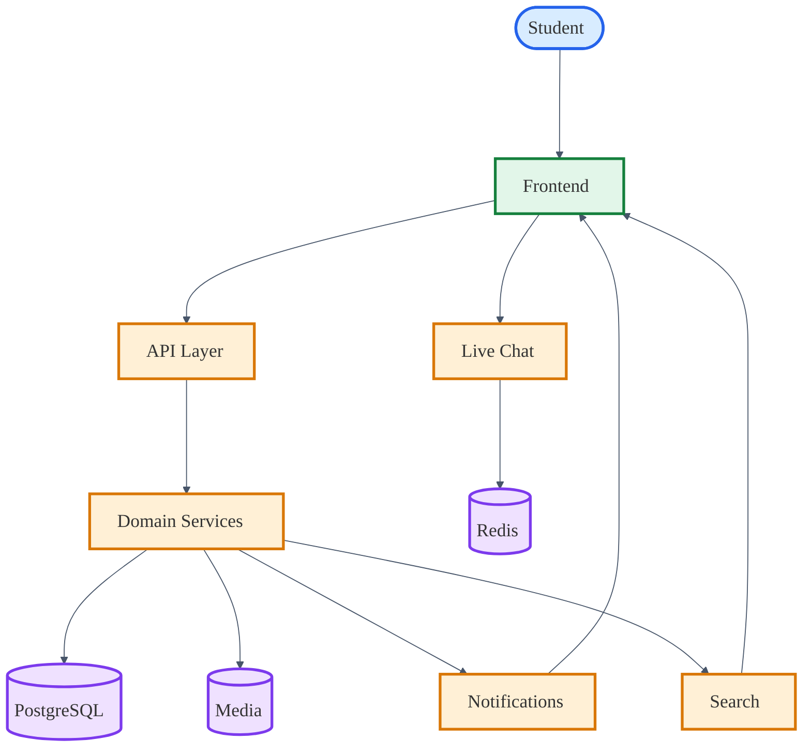

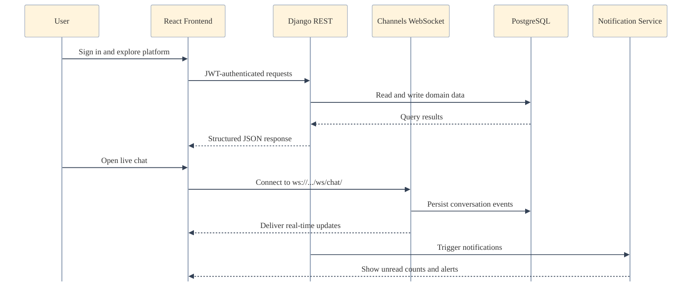

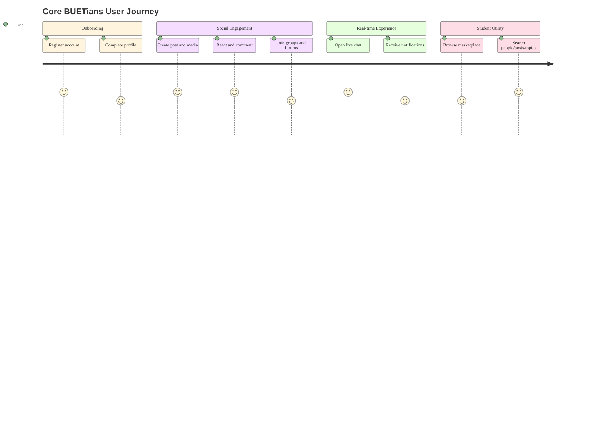

## Core Functionalities

- Authentication and profile lifecycle
- Social posting, comments, reactions, feed visibility
- Real-time one-to-one or threaded communication
- Group communities and group interactions
- Forum posting for focused community topics
- Marketplace listing and interactions
- Notification orchestration across modules
- Cross-module search routing

## Engineering Specialities

- Domain modularity: isolated Django apps for independent feature evolution
- API-first architecture: clear backend route groups for integration readiness
- Real-time capability: Channels + Daphne for low-latency chat events
- Media-ready design: structured media directories for upload domains
- SQL asset organization: dedicated schema/functions/procedures/triggers folders
- Frontend/backend decoupling: Vite client with proxy-based local integration

## Database Workflows

The database layer is intentionally split into schema, indexes, views, functions, procedures, and triggers so each concern stays visible and maintainable. The diagrams below show how read, write, and automation paths move through PostgreSQL.

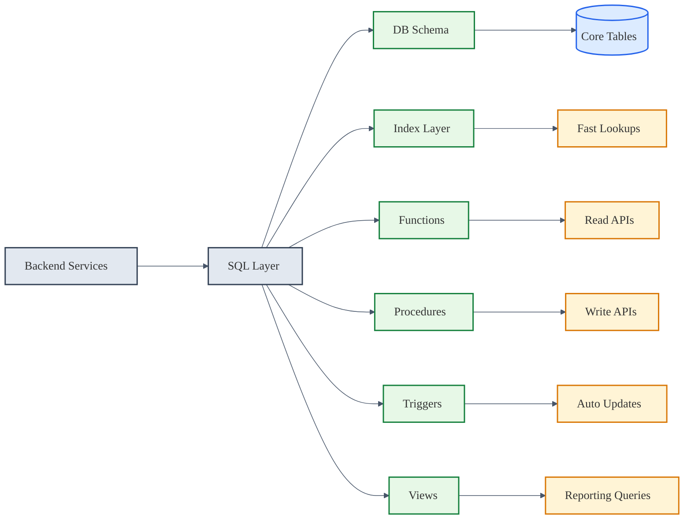

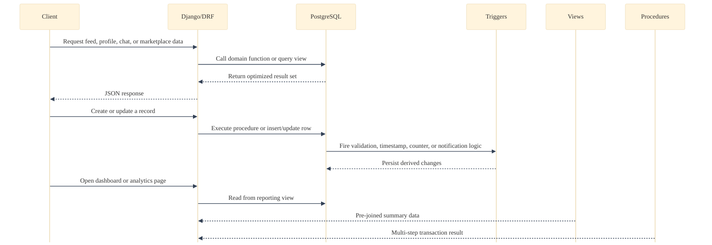

### SQL Layer Breakdown

- `BACKEND/sql/DB_SCHEMA.sql` defines the core tables and relationships.
- `BACKEND/sql/indexes.sql` speeds up common lookups, feed sorting, search, and notification retrieval.
- `BACKEND/sql/views/views.sql` exposes reporting and read-optimized projections such as activity, trending, and summary datasets.
- `BACKEND/sql/functions/*.sql` contains reusable query logic for users, posts, groups, marketplace, forums, chat, and notifications.
- `BACKEND/sql/procedures/procedures.sql` wraps multi-step operations such as creating content with related rows, toggling reactions, and confirming marketplace flows.
- `BACKEND/sql/triggers/triggers.sql` keeps timestamps, counters, validation, cleanup, and notification side effects in sync automatically.

### How The Pieces Work

- Functions handle repeatable read paths and return structured data for API endpoints.
- Indexes reduce scan cost for the most common filters, joins, and sorting patterns.
- Views consolidate multi-table reads into stable reporting surfaces.
- Triggers enforce automatic maintenance when rows change.
- Procedures group multiple statements into one transactional operation.

---

## Detailed Database Workflows

### Core Tables and Workflows

#### **Data Model Visualization**

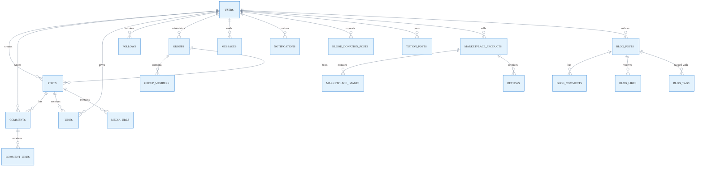

#### **Users Table**
- **Purpose**: Store user profiles, authentication data, and metadata.
- **Workflow**: 
  - User registers → row inserted → `set_user_defaults` trigger fires → sets `is_active = TRUE` if null
  - User profile updated → `update_users_timestamp` trigger fires → auto-updates `updated_at`
  - User deleted → `cleanup_user_data` trigger fires → deletes notifications, anonymizes messages
- **Related Operations**: Authentication, profile lookup by email/student_id, department/batch filtering.

#### **Posts Table**
- **Purpose**: Store user-generated posts with visibility and media type metadata.
- **Workflow**:
  - User creates post → row inserted → `update_posts_timestamp` fires → timestamp set
  - Like added to post → `increment_post_likes_count` trigger fires → `likes_count++`
  - Comment added to post → `increment_post_comments_count` trigger fires → `comments_count++`
  - Post deleted → `cleanup_post_data` trigger fires → deletes related notifications
- **Related Operations**: Feed generation (public/followers/private), visibility filtering, trending calculations.

#### **Comments Table**
- **Purpose**: Store comments and nested replies on posts.
- **Workflow**:
  - Comment inserted → `after_insert_comment` and `create_comment_notification` fire → counter incremented, notification created
  - Comment deleted → `after_delete_comment` fires → counter decremented
  - Parent comment referenced → nested reply relationship maintained via `comment_id` foreign key
- **Related Operations**: Comment threading, reply notifications, depth-aware retrieval.

#### **Likes Table**
- **Purpose**: Track post reactions from users (one row per user-post pair).
- **Workflow**:
  - Like inserted → `after_insert_like` and `create_like_notification` fire → post counter incremented, actor notified
  - Like deleted → `after_delete_like` fires → post counter decremented
  - Query for user's liked posts → indexed lookup returns results quickly
- **Related Operations**: Toggle like/unlike, liked feed, engagement scoring.

#### **Follows Table**
- **Purpose**: Track follower relationships with status (pending/accepted/rejected).
- **Workflow**:
  - Follow request created (status=pending) → `create_follow_notification` fires → notify receiver
  - Follow accepted (status→accepted) → `create_follow_notification` fires → notify sender
  - Before any follow insert → `validate_follow` trigger fires → rejects self-follows
- **Related Operations**: Profile followers, follow suggestions, access control for private posts.

#### **Groups Table**
- **Purpose**: Store group/community metadata and admin ownership.
- **Workflow**:
  - Group created → row inserted → `update_groups_timestamp` fires
  - Group cover image updated → `update_groups_timestamp` fires
- **Related Operations**: Group discovery, admin permissions, privacy filtering.

#### **Group Members Table**
- **Purpose**: Track membership status, role (member/admin/moderator), and join requests.
- **Workflow**:
  - User requests to join (status=pending) → `create_group_join_request_notification` fires → admin notified once
  - Join accepted (status→accepted) → role assigned (member/admin/moderator)
  - Member removed → cascading delete triggered
- **Related Operations**: Access control, role-based permissions, member listings.

#### **Marketplace Products Table**
- **Purpose**: Store product listings with status (available/sold/reserved).
- **Workflow**:
  - Product created → row inserted → seller_id indexed, status=available
  - Product sold (status→sold) → `update_marketplace_timestamp` fires, buyer cannot edit
  - Product updated → `update_marketplace_timestamp` fires
- **Related Operations**: Product discovery by category/condition/price, seller reputation.

#### **Marketplace Product Images Table**
- **Purpose**: Store multiple images per product via one-to-many relationship.
- **Workflow**:
  - Image inserted during product creation via `create_product_with_images` procedure
  - Product deleted → cascade deletes all images
  - Query product images → indexed by `product_id` for fast retrieval
- **Related Operations**: Product gallery, media carousel.

#### **Messages Table**
- **Purpose**: Store chat messages between users with read flag and optional product context.
- **Workflow**:
  - Message sent → `create_message_notification` trigger fires → receiver notified
  - Message marked read (is_read=true) → no trigger (manual API call)
  - Query conversation → indexed by (sender, receiver, created_at DESC) for fast retrieval
- **Related Operations**: Chat history, unread counts, conversation threading.

#### **Notifications Table**
- **Purpose**: Track all user notifications (likes, comments, follows, messages, group invites, blog alerts).
- **Workflow**:
  - Any trigger fire (like, comment, follow, message, etc.) → row inserted into notifications
  - User views notification → `is_read = TRUE` set via API
  - `mark_all_notifications_read()` function called → bulk mark all user's notifications as read
- **Related Operations**: Notification feed, unread badge, notification preferences.

#### **Blog Posts Table**
- **Purpose**: Store published and draft blog articles with scheduled publish support.
- **Workflow**:
  - Blog created (via `create_blog_post_with_tags` procedure) → row inserted, tags inserted separately
  - Blog updated (via `update_blog_post_with_tags` procedure) → content updated, tags recreated
  - Blog published (is_published=true, published_at set) → `update_blog_timestamp` fires
- **Related Operations**: Blog listing, draft/published filtering, author's blog history.

#### **Blog Comments Table**
- **Purpose**: Store comments on blog posts with optional parent comment for threading.
- **Workflow**:
  - Comment added (via `add_blog_comment_with_notification` procedure) → row inserted, notification fired
  - Blog comment deleted → cascade deletes child comments
  - Comment retrieved → indexed by (blog_id, created_at DESC)
- **Related Operations**: Comment threads, nested reply display.

#### **Blog Likes Table**
- **Purpose**: Track blog reactions (one row per user-blog pair).
- **Workflow**:
  - Like inserted → `increment_blog_likes_count` trigger fires → blog counter incremented
  - Like deleted → `decrement_blog_likes_count` trigger fires → blog counter decremented
  - Notification fired → blog author notified of like
- **Related Operations**: Like toggle, liked blog feed, blog popularity.

#### **Blood Donation Posts Table**
- **Purpose**: Store urgent and non-urgent blood donation requests.
- **Workflow**:
  - Request created → indexed by (blood_group, urgency, status, needed_date)
  - Request updated (status: active/fulfilled/cancelled) → `update_blood_donation_timestamp` fires
  - Urgent request active → indexed and featured in search/discovery
- **Related Operations**: Blood search by group and location, urgent filtering, request history.

#### **Tuition Posts Table**
- **Purpose**: Store seeking/offering tuition posts with salary and subject metadata.
- **Workflow**:
  - Tuition post created (via `create_tuition_post_with_subjects` procedure) → post and subjects inserted
  - Post updated (via `update_tuition_post_with_subjects` procedure) → post updated, subjects replaced
  - Search by subject → joined via `tution_post_subjects` table
- **Related Operations**: Tuition discovery by subject, salary filtering, active post listings.

---

### Trigger Automation Sequences

#### **Like Action Trigger Cascade**

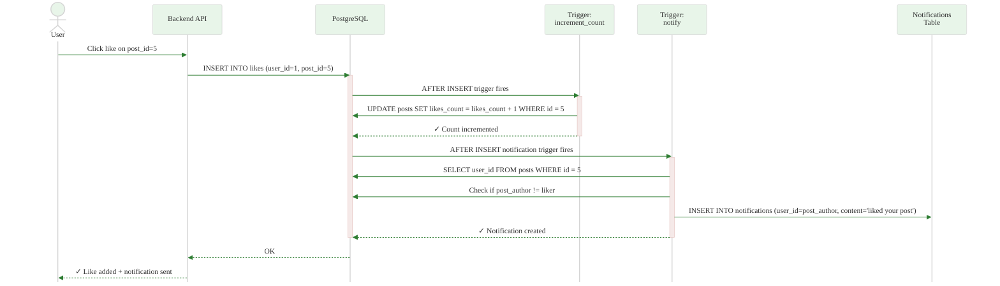

#### **Comment Posting Trigger Cascade**

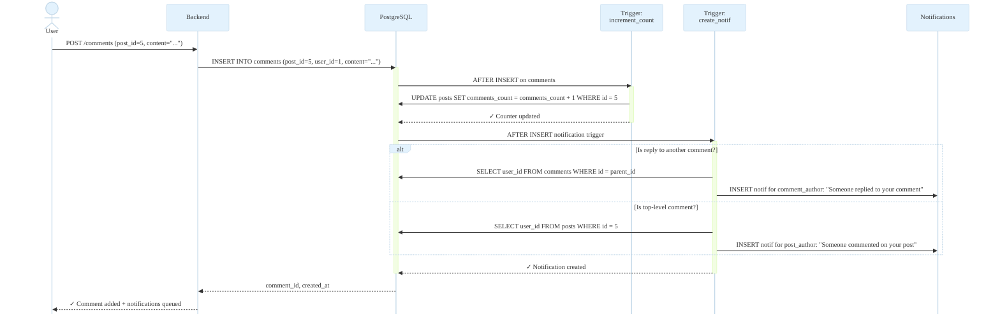

#### **Follow Request Accept Trigger Cascade**

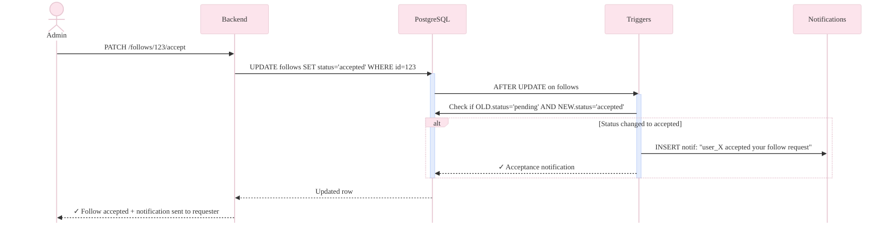

---

### Index Optimization Sequences

#### **Query Execution with Index Selection**

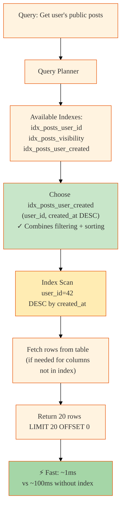

#### **Full-Text Search Index Flow**

```mermaid
%%{init: {'theme':'base', 'flowchart': {'curve': 'basis'}, 'themeVariables': { 'fontFamily': 'Segoe UI, sans-serif', 'primaryColor': '#F3E5F5', 'primaryBorderColor': '#6A1B9A' }}}%%
flowchart LR
    USER["User searches:<br/>'machine learning'"] --> PARSE["Parse search term<br/>plainto_tsquery"]
    PARSE --> TSVEC["Convert to tsvector<br/>english language<br/>tokenization"]
    TSVEC --> GIN["Hit GIN Index<br/>idx_posts_content_fts<br/>⚡ O(log N)"]
    GIN --> RANK["Rank by ts_rank()<br/>relevance scoring"]
    RANK --> SORT["Sort by relevance<br/>then by created_at"]
    SORT --> RESULT["Return 20 matching posts"]
    
    style GIN fill:#E1BEE7
    style RESULT fill:#CE93D8
```

---

### Procedure Transaction Flows

#### **Product Creation with Images (Atomic Transaction)**

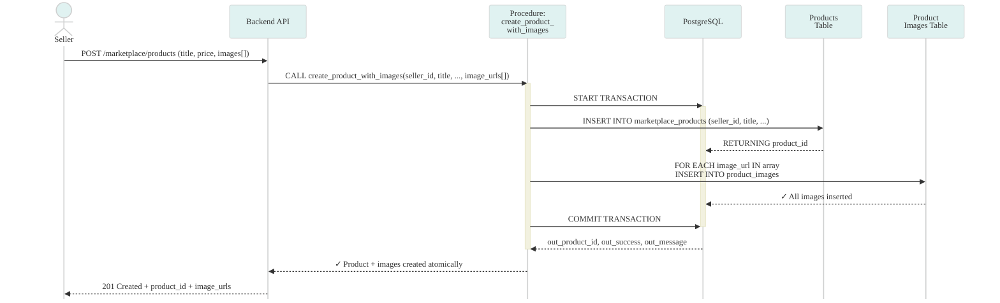

#### **Follow Request Toggle with Cleanup**

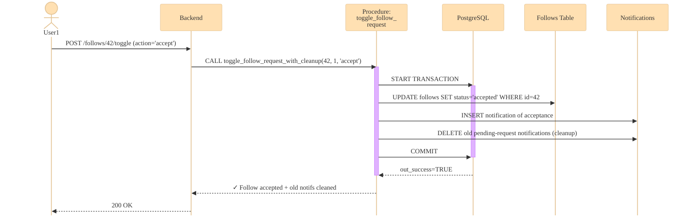

---

### Index Optimization Strategies

#### **User Indexes**
- `idx_users_email` – Fast login by email (UNIQUE natural key)
- `idx_users_student_id` – Fast lookup by student ID (UNIQUE natural key)
- `idx_users_is_active` – Filter active users only (low cardinality, high selectivity)
- `idx_users_department`, `idx_users_batch`, `idx_users_blood_group` – Faceted search filtering
- `idx_users_dept_batch` – Composite for cohort queries
- `idx_users_name_fts` – Full-text search on name (GIN index for English text)
- `idx_users_created_at DESC` – Sort new users by signup date

#### **Post Indexes**
- `idx_posts_user_id` – Fetch user's posts
- `idx_posts_group_id` – Fetch group posts
- `idx_posts_visibility` – Filter public/followers/private
- `idx_posts_media_type` – Filter text-only vs. media posts
- `idx_posts_created_at DESC` – Chronological sorting for feeds
- `idx_posts_user_created` – User's posts sorted by time
- `idx_posts_group_created` – Group posts sorted by time
- `idx_posts_likes_count DESC`, `idx_posts_comments_count DESC` – Popular post ranking
- `idx_posts_content_fts` – Full-text search on content (GIN for English)
- `idx_posts_public_recent` – Partial index: public posts only, sorted DESC, avoids null rows

#### **Comment Indexes**
- `idx_comments_post_id` – Fetch comments for a post
- `idx_comments_user_id` – Fetch user's comments
- `idx_comments_comment_id` – Fetch replies to a comment
- `idx_comments_post_created` – Comments on a post sorted by time
- `idx_comments_parent_created` – Replies to a comment sorted by time (ASC for threading order)

#### **Like/Reaction Indexes**
- `idx_likes_user_post` – Unique constraint for toggle (user hasn't liked this post yet?)
- `idx_likes_post_id` – Fetch all who liked a post
- `idx_likes_user_id` – Fetch all posts a user liked (for liked feed)

#### **Follow Indexes**
- `idx_follows_follower` – Fetch who a user follows
- `idx_follows_following` – Fetch a user's followers
- `idx_follows_status` – Filter pending/accepted/rejected
- `idx_follows_follower_status` – User's accepted followers only
- `idx_follows_following_status` – User's accepted following only
- `idx_follows_accepted` – Partial index: only accepted follows (highest selectivity)

#### **Group Indexes**
- `idx_groups_admin_id` – Groups managed by an admin
- `idx_groups_is_private` – Public vs. private group filtering
- `idx_groups_name_fts`, `idx_groups_description_fts` – Full-text search on group metadata

#### **Group Members Indexes**
- `idx_group_members_group_status` – Members of a group filtered by status
- `idx_group_members_user_status` – Groups a user is in, filtered by status
- `idx_group_members_group_user` – Membership check (is user X a member of group Y?)
- `idx_group_members_role` – Filter admins/moderators vs. regular members

#### **Marketplace Indexes**
- `idx_marketplace_category_status` – Products in category that are available
- `idx_marketplace_status_price` – Available products sorted by price range
- `idx_marketplace_seller_status` – Seller's active listings
- `idx_marketplace_title_fts` – Full-text search on product title + description
- `idx_marketplace_available` – Partial index: only available products, sorted by recency

#### **Messages Indexes**
- `idx_messages_conversation` – Conversation thread (canonical order: LEAST/GREATEST for bidirectionality)
- `idx_messages_receiver_unread` – Unread messages for a user (partial index filters is_read=FALSE)

#### **Notification Indexes**
- `idx_notifications_user_read` – User's notifications, filtered by read status, sorted by time
- `idx_notifications_user_type` – Notifications of a specific type for a user
- `idx_notifications_unread` – User's unread notifications (partial index)

#### **Blog Indexes**
- `idx_blog_published_date` – Published blogs sorted by publish time (partial index)
- `idx_blog_title_content_fts` – Full-text search on blog title + content
- `idx_blog_likes_count DESC` – Popular blogs
- `idx_blog_comments_blog_created` – Comments on a blog sorted by time

#### **Blood Donation Indexes**
- `idx_blood_donation_group_status` – Active requests for a blood group
- `idx_blood_donation_urgent_active` – Urgent active requests (partial index, high priority)

#### **Tuition Indexes**
- `idx_tution_post_type`, `idx_tution_status` – Filter seeking vs. offering, and status
- `idx_tution_status_salary` – Salary range filtering on active posts
- `idx_tution_active` – Partial index: active posts only

---

### Trigger Automation Logic

#### **Timestamp Triggers**
- Fires on `UPDATE` for: users, posts, comments, groups, marketplace_products, blood_donation_posts, tution_posts, blog_posts
- **Effect**: Auto-updates `updated_at = CURRENT_TIMESTAMP`
- **Use Case**: Audit trail, sorting by recency, freshness.

#### **Counter Triggers**
- `after_insert_like` → `increment_post_likes_count()` → `posts.likes_count++`
- `after_delete_like` → `decrement_post_likes_count()` → `posts.likes_count--` (GREATEST to prevent negatives)
- `after_insert_comment` → `increment_post_comments_count()` → `posts.comments_count++`
- `after_delete_comment` → `decrement_post_comments_count()` → `posts.comments_count--`
- `after_insert_blog_like` → `increment_blog_likes_count()` → `blog_posts.likes_count++`
- `after_delete_blog_like` → `decrement_blog_likes_count()` → `blog_posts.likes_count--`
- **Use Case**: Denormalized counters for fast leaderboards, trending calculations.

#### **Notification Triggers**
- `after_follow_action` (INSERT/UPDATE on follows) → `create_follow_notification()`
  - If status='pending': notify receiver of follow request
  - If status='accepted' & old status='pending': notify sender that request was accepted
- `after_insert_like_notification` (INSERT on likes) → `create_like_notification()`
  - Checks post author ≠ liker → inserts notification
- `after_insert_comment_notification` (INSERT on comments) → `create_comment_notification()`
  - If top-level comment (comment_id IS NULL): notify post author
  - If reply (comment_id IS NOT NULL): notify parent comment author
- `after_insert_message_notification` (INSERT on messages) → `create_message_notification()`
  - Always notify receiver of new message
- `after_group_member_insert` (INSERT on group_members) → `create_group_join_request_notification()`
  - If status='pending': notify group admin of join request (duplicate check prevents duplicates)
- `after_insert_blog_like_notification` (INSERT on blog_likes) → `create_blog_like_notification()`
  - Checks blog author ≠ liker → inserts notification
- `after_insert_blog_comment_notification` (INSERT on blog_comments) → `create_blog_comment_notification()`
  - Checks blog author ≠ commenter → inserts notification
- **Use Case**: Real-time activity feeds, reactive engagement.

#### **Validation Triggers**
- `before_follow_validation` (BEFORE INSERT/UPDATE on follows) → `validate_follow()`
  - **Effect**: RAISE EXCEPTION if follower_id = following_id (prevent self-follow)
  - **Use Case**: Data integrity constraint.

#### **Default Triggers**
- `before_user_insert_defaults` (BEFORE INSERT on users) → `set_user_defaults()`
  - **Effect**: If is_active is NULL, set to TRUE
  - **Use Case**: Simplify API logic (users are active by default).

#### **Cleanup Triggers**
- `before_user_delete_cleanup` (BEFORE DELETE on users) → `cleanup_user_data()`
  - **Effect**: Delete all notifications from/to user, anonymize messages from user
  - **Use Case**: GDPR compliance, data retention.
- `before_post_delete_cleanup` (BEFORE DELETE on posts) → `cleanup_post_data()`
  - **Effect**: Delete related notifications (likes, comments on this post)
  - **Use Case**: Remove orphaned notifications.

#### **Statistics Triggers** (Placeholder)
- `after_post_insert_statistics`, `after_post_delete_statistics`, `after_comment_insert_statistics`
- Currently NOP (user_analysis table exists but not actively populated)
- **Intended Use**: Track per-user activity for analytics.

---

### Procedures and Transactional Operations

#### **Blog Operations**
- `create_blog_post_with_tags(author_id, title, content, excerpt, cover_image, category, is_published, tags[], scheduled_publish_at)`
  - Creates blog post + inserts all tags in one transaction
  - Returns: out_blog_id, out_success, out_message
  - **Use Case**: Atomic multi-row creation.

- `update_blog_post_with_tags(blog_id, author_id, ...fields..., tags[])`
  - Updates blog post, deletes old tags, inserts new tags (permission check: author only)
  - Returns: out_success, out_message
  - **Use Case**: Ensure author cannot edit others' blogs.

- `delete_blog_post(blog_id, author_id)`
  - Deletes blog post (permission check: author only)
  - Returns: out_success, out_message

- `toggle_blog_like_with_notification(user_id, blog_id)`
  - Toggles like on blog, creates notification if target author ≠ user, prevents duplicate notifications
  - Returns: out_liked (true/false after toggle), out_likes_count, out_success, out_message

- `add_blog_comment_with_notification(user_id, blog_id, content, parent_comment_id)`
  - Adds comment to blog, validates parent comment if provided
  - Returns: out_comment_id, out_success, out_message

- `toggle_blog_comment_like_with_notification(user_id, comment_id)`
  - Toggles like on blog comment, notifies comment author if different

#### **Post Operations**
- `add_comment_with_notification(user_id, post_id, content, parent_comment_id, reference_id)`
  - Adds comment to post, notifies post author or parent comment author
  - Returns: out_comment_id, out_success, out_message

- `toggle_comment_like_with_notification(user_id, comment_id)`
  - Toggles like on comment, prevents self-notification

- `create_post_with_media(user_id, content, media_type, visibility, group_id, media_url[])`
  - Creates post + inserts all media URLs in one transaction
  - Returns: out_post_id, out_success, out_message

- `create_group_post_with_media(user_id, group_id, content, media_type, media_url[])`
  - Creates post in group + media URLs (group membership check)

#### **Marketplace Operations**
- `create_product_with_images(seller_id, title, description, price, category, condition, location, status, image_url[])`
  - Creates product + inserts all images in one transaction
  - Returns: out_product_id, out_success, out_message

- `create_or_update_review(product_id, buyer_id, seller_id, rating, review_text)`
  - Creates or updates review (one review per buyer-product pair, UNIQUE constraint)
  - Updates `seller_reputation` table (average_rating, total_reviews, last_updated)
  - Returns: out_success, out_message

- `confirm_marketplace_transaction(product_id, buyer_id, seller_id, confirmer_type)`
  - Toggles buyer/seller confirmation flag on `buyer_seller_transactions` table
  - When both confirmed: product status → 'sold'
  - Returns: out_both_confirmed, out_success, out_message

#### **Tuition Operations**
- `create_tuition_post_with_subjects(user_id, post_type, class_level, ..., subject_name[])`
  - Creates tuition post + inserts all subjects in one transaction

- `update_tuition_post_with_subjects(post_id, user_id, ..., subject_name[])`
  - Updates post, deletes old subjects, inserts new subjects (permission check: owner only)

#### **Group Operations**
- `create_group_with_creator(admin_id, name, description, is_private, cover_image)`
  - Creates group + inserts admin as group_member with role='admin'
  - Returns: out_group_id, out_success, out_message

- `toggle_follow_request_with_cleanup(follower_id, following_id, action: 'accept'|'reject')`
  - Accepts or rejects follow request, sends notification, cleans up pending notifications
  - Returns: out_success, out_message

---

### Functions and Query Patterns

#### **User Functions**
- `get_mutual_followers(user_id)` – Returns users who both follow each other
- `search_users_advanced(search_term, filters: department, batch, blood_group)` – Full-text search + faceted filtering
- `get_users_by_department(department)` – All users in a department
- `get_users_by_blood_group(blood_group)` – All users with a blood group (for donation discovery)
- `get_user_profile(user_id, viewer_id)` – Profile card data (posts, followers, following counts, follow status)
- `accept_follow_request(follow_id, user_id)` – Transitions follow.status from pending → accepted
- `reject_follow_request(follow_id, user_id)` – Deletes follow row
- `get_pending_follow_requests(user_id)` – All pending follow requests received by user
- `get_suggested_users(user_id, limit)` – User recommendations based on department, batch, mutual followers
- `can_users_chat(user1_id, user2_id)` – Check if users can message (follows? same group? marketplace context?)

#### **Post Functions**
- `get_user_posts(user_id, viewer_id, limit, offset)` – Paginated posts from a user, respecting visibility (public/followers/private), includes is_liked flag
- `get_posts_by_hashtag(hashtag, limit)` – Posts containing hashtag (full-text search on content)
- `search_posts(search_term, limit)` – Full-text search on public posts
- `get_user_liked_posts(user_id, limit, offset)` – Posts a user has liked
- `get_post_details(post_id, viewer_id)` – Single post with author info, media, like count, comment count, is_liked flag
- `get_post_comments(post_id, limit, offset)` – Paginated comments on a post (top-level + replies threaded)
- `get_user_feed(user_id, limit, offset)` – Personalized feed (user's posts + followers' public posts, sorted by recency)
- `get_trending_posts(limit)` – Posts from last 7 days sorted by engagement score
- `get_trending_hashtags(limit)` – Most frequent hashtags in recent posts
- `get_posts_by_media_type(media_type, limit, offset)` – Filter posts by text/image/video
- `get_post_engagement_stats(post_id)` – Returns likes_count, comments_count, top commenters

#### **Marketplace Functions**
- `get_user_marketplace_stats(user_id)` – Seller stats: total products, sold count, average rating, total reviews
- `get_product_details(product_id)` – Product with seller info, images, reviews, condition, price
- `get_similar_products(product_id, limit)` – Products in same category + price range (for "related" section)
- `get_trending_products(limit)` – Products sorted by recency (assumption: recent → trending)
- `get_department_products(user_id, limit)` – Products from users in same department
- `get_price_range_stats()` – Min, max, average price across all products
- `mark_product_sold(product_id)` – Updates product.status → 'sold'
- `reserve_product(product_id)` – Updates product.status → 'reserved'

#### **Forum/Tuition/Blood Functions**
- `get_user_blood_requests(user_id)` – All blood donation requests from a user
- `search_blood_requests_by_location(location_term, radius_km)` – Location-based blood search
- `update_blood_request_status(request_id, status)` – Marks request active/fulfilled/cancelled
- `get_blood_request_details(request_id)` – Request with requester info + medical details
- `get_tuition_stats_by_subject()` – Count of tuition posts grouped by subject
- `search_tuition_posts(post_type, class_level, salary_min, salary_max, subject_list)` – Filtered tuition search
- `update_tuition_post_status(post_id, status)` – Marks tuition active/completed/cancelled
- `get_user_tuition_posts(user_id)` – All tuition posts from a user
- `get_tuition_post_details(post_id)` – Tuition post with all subjects and requirements

#### **Notification Functions**
- `get_unread_notification_count(user_id)` – Single COUNT query for badge
- `mark_all_notifications_read(user_id)` – Bulk update is_read=TRUE for user
- `mark_notifications_read_by_type(user_id, notification_type)` – Bulk update by type
- `get_activity_notifications(user_id, limit, offset)` – Paginated notifications, newest first
- `get_notification_summary(user_id)` – Aggregated counts by type (likes, comments, follows, etc.)

#### **Message Functions**
- `get_recent_conversations(user_id)` – All conversations (unique other_user), last message, unread count
- `search_messages(user_id, search_term, limit)` – Full-text search on message content
- `get_conversation_participants(user_id, other_user_id)` – All messages in conversation thread, including is_read flags
- `get_unread_messages_count(user_id)` – Count of unread messages per other user
- `get_total_unread_messages(user_id)` – Total unread message count
- `delete_conversation(user_id, other_user_id)` – Soft delete (or hard delete) for user's local copy
- `mark_conversation_read(user_id, other_user_id)` – Mark all messages in conversation as read
- `get_user_message_stats(user_id)` – Total messages sent/received, total conversations

#### **Group Functions**
- `get_user_groups(user_id, limit, offset)` – Groups a user is a member of (accepted status)
- `get_group_details(group_id)` – Group with admin info, member count, post count, is_user_member flag
- `get_group_members_list(group_id)` – All members with role and status
- `get_group_activity(group_id, limit, offset)` – Recent posts in group
- `get_suggested_groups(user_id, limit)` – Group recommendations based on department, batch, mutual members
- `search_groups(search_term, limit)` – Full-text search on group name + description
- `promote_to_moderator(group_id, user_id, admin_id)` – Role update (permission check: admin)
- `demote_moderator(group_id, user_id, admin_id)` – Downgrade role
- `transfer_group_admin(group_id, new_admin_id, current_admin_id)` – Change group ownership
- `is_group_member(group_id, user_id)` – Boolean check (used in permission gates)

#### **Platform Analytics Functions**
- `get_platform_statistics()` – Total users, posts, comments, follows, groups (for dashboard)
- `get_user_activity_summary(user_id)` – User's posts, comments, likes given, likes received, followers, following
- `get_user_engagement_metrics(user_id)` – Deep engagement stats for user profile visualizations
- `get_users_by_department(department_name, limit)` – Cohort-based discovery

#### **Chat Permission Functions**
- `can_user_message(user_id, target_user_id, context_type?, context_id?)` – Checks if users can DM (follows? same group? marketplace context?)

---

### Materialized Views and Reporting Layers

#### **View Refresh Animation**

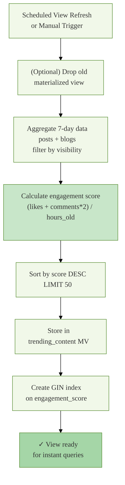

#### **Trending Content View**
- **Purpose**: Pre-aggregated 7-day trending posts + blogs ranked by engagement score
- **Update Strategy**: Manually refreshed via `REFRESH MATERIALIZED VIEW trending_content`
- **Query Pattern**: JOIN posts + blog_posts, calculate engagement/hour, LIMIT 50

#### **User Recommendations View**
- **Purpose**: Suggest users to follow based on mutual friends + same cohort
- **Update Strategy**: Manually refreshed
- **Logic**: For each user, find non-following users in same department/batch with mutual friends count > 0

#### **Active Users View**
- **Purpose**: Users with activity in last 7 days (post/comment/like)
- **Logic**: MAX recent timestamp across posts, comments, likes tables

#### **User Profiles with Stats View**
- **Purpose**: User profile card (id, name, picture, department, batch, posts_count, followers_count, following_count, groups_count)
- **Logic**: Left join to counts, filter is_active=TRUE

#### **User Engagement Metrics View**
- **Purpose**: Engagement dashboard (posts, comments, likes sent, likes received, followers, following)
- **Usage**: Profile statistics, leaderboards

#### **Department and Batch Statistics Views**
- **Purpose**: Cohort-level metrics (total users, active users, total posts, groups created)
- **Usage**: Admin analytics, trending topics by department

#### **Daily Statistics Views**
- **Purpose**: `daily_user_stats` (new users per day), `daily_post_stats` (posts per day, media posts, total likes/comments)
- **Usage**: Growth tracking, engagement trends

#### **Table Sizes View**
- **Purpose**: Monitor growth of each table (schema size, index size, total size)
- **Usage**: Capacity planning, index review

---

### Query Execution Paths with Performance Visualization

#### **Feed Generation** (High-Traffic Path)

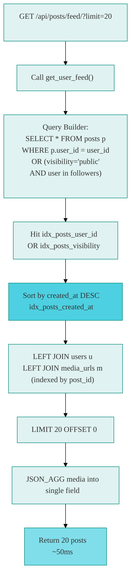

#### **Notification Badge** (Real-Time Path)

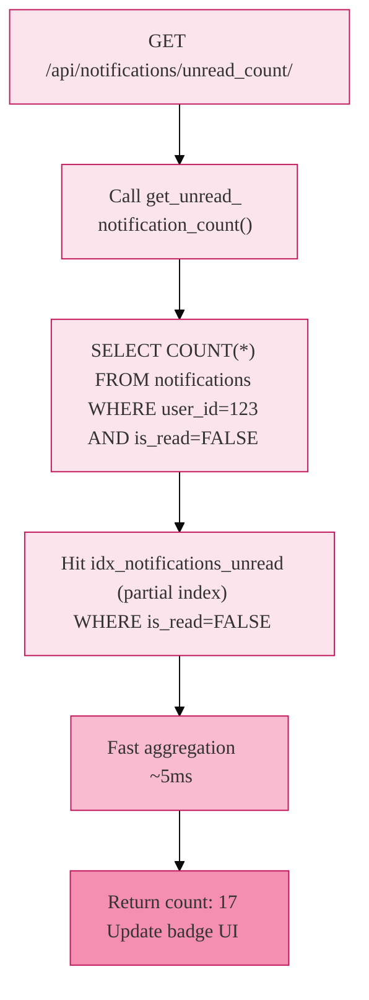

#### **Like/Unlike Toggle** (Transaction Path)

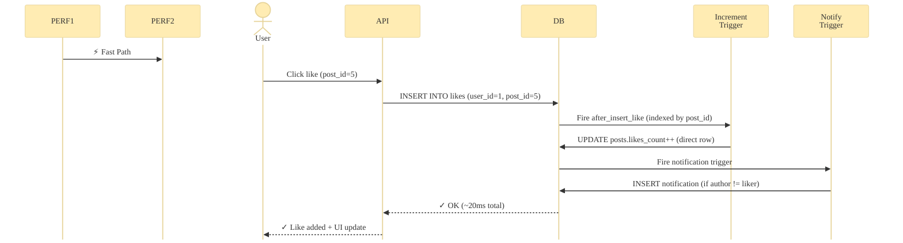

#### **Full-Text Search** (Text Retrieval Path)

```mermaid
%%{init: {'theme':'base', 'flowchart': {'curve': 'basis'}, 'themeVariables': { 'fontFamily': 'Segoe UI, sans-serif', 'primaryColor': '#F3E5F5', 'primaryBorderColor': '#7B1FA2' }}}%%
flowchart LR
    USER["User searches:<br/>'machine learning'"] --> PARSE["Parse to tsvector<br/>English tokenization"]
    PARSE --> GIN["GIN Index Lookup<br/>idx_posts_content_fts"]
    GIN --> MATCH["Matching posts<br/>retrieved"]
    MATCH --> RANK["Rank by ts_rank()<br/>relevance"]
    RANK --> SORT["Sort relevance DESC<br/>then created_at DESC"]
    SORT --> LIMIT["Return LIMIT 20"]
    LIMIT --> FAST["Result: ~15ms<br/>⚡ Fast retrieval"]
    
    style GIN fill:#E1BEE7
    style FAST fill:#CE93D8
```

#### **Marketplace Discovery** (Filter + Sort Path)

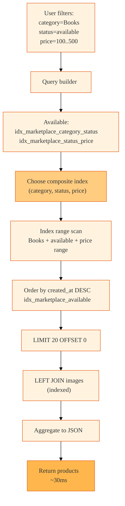

---

## Architecture Overview
- **Purpose**: Store user profiles, authentication data, and metadata.
- **Workflow**: 
  - User registers → row inserted → `set_user_defaults` trigger fires → sets `is_active = TRUE` if null
  - User profile updated → `update_users_timestamp` trigger fires → auto-updates `updated_at`
  - User deleted → `cleanup_user_data` trigger fires → deletes notifications, anonymizes messages
- **Related Operations**: Authentication, profile lookup by email/student_id, department/batch filtering.

#### **Posts Table**
- **Purpose**: Store user-generated posts with visibility and media type metadata.
- **Workflow**:
  - User creates post → row inserted → `update_posts_timestamp` fires → timestamp set
  - Like added to post → `increment_post_likes_count` trigger fires → `likes_count++`
  - Comment added to post → `increment_post_comments_count` trigger fires → `comments_count++`
  - Post deleted → `cleanup_post_data` trigger fires → deletes related notifications
- **Related Operations**: Feed generation (public/followers/private), visibility filtering, trending calculations.

#### **Comments Table**
- **Purpose**: Store comments and nested replies on posts.
- **Workflow**:
  - Comment inserted → `after_insert_comment` and `create_comment_notification` fire → counter incremented, notification created
  - Comment deleted → `after_delete_comment` fires → counter decremented
  - Parent comment referenced → nested reply relationship maintained via `comment_id` foreign key
- **Related Operations**: Comment threading, reply notifications, depth-aware retrieval.

#### **Likes Table**
- **Purpose**: Track post reactions from users (one row per user-post pair).
- **Workflow**:
  - Like inserted → `after_insert_like` and `create_like_notification` fire → post counter incremented, actor notified
  - Like deleted → `after_delete_like` fires → post counter decremented
  - Query for user's liked posts → indexed lookup returns results quickly
- **Related Operations**: Toggle like/unlike, liked feed, engagement scoring.

#### **Follows Table**
- **Purpose**: Track follower relationships with status (pending/accepted/rejected).
- **Workflow**:
  - Follow request created (status=pending) → `create_follow_notification` fires → notify receiver
  - Follow accepted (status→accepted) → `create_follow_notification` fires → notify sender
  - Before any follow insert → `validate_follow` trigger fires → rejects self-follows
- **Related Operations**: Profile followers, follow suggestions, access control for private posts.

#### **Groups Table**
- **Purpose**: Store group/community metadata and admin ownership.
- **Workflow**:
  - Group created → row inserted → `update_groups_timestamp` fires
  - Group cover image updated → `update_groups_timestamp` fires
- **Related Operations**: Group discovery, admin permissions, privacy filtering.

#### **Group Members Table**
- **Purpose**: Track membership status, role (member/admin/moderator), and join requests.
- **Workflow**:
  - User requests to join (status=pending) → `create_group_join_request_notification` fires → admin notified once
  - Join accepted (status→accepted) → role assigned (member/admin/moderator)
  - Member removed → cascading delete triggered
- **Related Operations**: Access control, role-based permissions, member listings.

#### **Marketplace Products Table**
- **Purpose**: Store product listings with status (available/sold/reserved).
- **Workflow**:
  - Product created → row inserted → seller_id indexed, status=available
  - Product sold (status→sold) → `update_marketplace_timestamp` fires, buyer cannot edit
  - Product updated → `update_marketplace_timestamp` fires
- **Related Operations**: Product discovery by category/condition/price, seller reputation.

#### **Marketplace Product Images Table**
- **Purpose**: Store multiple images per product via one-to-many relationship.
- **Workflow**:
  - Image inserted during product creation via `create_product_with_images` procedure
  - Product deleted → cascade deletes all images
  - Query product images → indexed by `product_id` for fast retrieval
- **Related Operations**: Product gallery, media carousel.

#### **Messages Table**
- **Purpose**: Store chat messages between users with read flag and optional product context.
- **Workflow**:
  - Message sent → `create_message_notification` trigger fires → receiver notified
  - Message marked read (is_read=true) → no trigger (manual API call)
  - Query conversation → indexed by (sender, receiver, created_at DESC) for fast retrieval
- **Related Operations**: Chat history, unread counts, conversation threading.

#### **Notifications Table**
- **Purpose**: Track all user notifications (likes, comments, follows, messages, group invites, blog alerts).
- **Workflow**:
  - Any trigger fire (like, comment, follow, message, etc.) → row inserted into notifications
  - User views notification → `is_read = TRUE` set via API
  - `mark_all_notifications_read()` function called → bulk mark all user's notifications as read
- **Related Operations**: Notification feed, unread badge, notification preferences.

#### **Blog Posts Table**
- **Purpose**: Store published and draft blog articles with scheduled publish support.
- **Workflow**:
  - Blog created (via `create_blog_post_with_tags` procedure) → row inserted, tags inserted separately
  - Blog updated (via `update_blog_post_with_tags` procedure) → content updated, tags recreated
  - Blog published (is_published=true, published_at set) → `update_blog_timestamp` fires
- **Related Operations**: Blog listing, draft/published filtering, author's blog history.

#### **Blog Comments Table**
- **Purpose**: Store comments on blog posts with optional parent comment for threading.
- **Workflow**:
  - Comment added (via `add_blog_comment_with_notification` procedure) → row inserted, notification fired
  - Blog comment deleted → cascade deletes child comments
  - Comment retrieved → indexed by (blog_id, created_at DESC)
- **Related Operations**: Comment threads, nested reply display.

#### **Blog Likes Table**
- **Purpose**: Track blog reactions (one row per user-blog pair).
- **Workflow**:
  - Like inserted → `increment_blog_likes_count` trigger fires → blog counter incremented
  - Like deleted → `decrement_blog_likes_count` trigger fires → blog counter decremented
  - Notification fired → blog author notified of like
- **Related Operations**: Like toggle, liked blog feed, blog popularity.

#### **Blood Donation Posts Table**
- **Purpose**: Store urgent and non-urgent blood donation requests.
- **Workflow**:
  - Request created → indexed by (blood_group, urgency, status, needed_date)
  - Request updated (status: active/fulfilled/cancelled) → `update_blood_donation_timestamp` fires
  - Urgent request active → indexed and featured in search/discovery
- **Related Operations**: Blood search by group and location, urgent filtering, request history.

#### **Tuition Posts Table**
- **Purpose**: Store seeking/offering tuition posts with salary and subject metadata.
- **Workflow**:
  - Tuition post created (via `create_tuition_post_with_subjects` procedure) → post and subjects inserted
  - Post updated (via `update_tuition_post_with_subjects` procedure) → post updated, subjects replaced
  - Search by subject → joined via `tution_post_subjects` table
- **Related Operations**: Tuition discovery by subject, salary filtering, active post listings.

---

### Index Optimization Strategies

#### **User Indexes**
- `idx_users_email` – Fast login by email (UNIQUE natural key)
- `idx_users_student_id` – Fast lookup by student ID (UNIQUE natural key)
- `idx_users_is_active` – Filter active users only (low cardinality, high selectivity)
- `idx_users_department`, `idx_users_batch`, `idx_users_blood_group` – Faceted search filtering
- `idx_users_dept_batch` – Composite for cohort queries
- `idx_users_name_fts` – Full-text search on name (GIN index for English text)
- `idx_users_created_at DESC` – Sort new users by signup date

#### **Post Indexes**
- `idx_posts_user_id` – Fetch user's posts
- `idx_posts_group_id` – Fetch group posts
- `idx_posts_visibility` – Filter public/followers/private
- `idx_posts_media_type` – Filter text-only vs. media posts
- `idx_posts_created_at DESC` – Chronological sorting for feeds
- `idx_posts_user_created` – User's posts sorted by time
- `idx_posts_group_created` – Group posts sorted by time
- `idx_posts_likes_count DESC`, `idx_posts_comments_count DESC` – Popular post ranking
- `idx_posts_content_fts` – Full-text search on content (GIN for English)
- `idx_posts_public_recent` – Partial index: public posts only, sorted DESC, avoids null rows

#### **Comment Indexes**
- `idx_comments_post_id` – Fetch comments for a post
- `idx_comments_user_id` – Fetch user's comments
- `idx_comments_comment_id` – Fetch replies to a comment
- `idx_comments_post_created` – Comments on a post sorted by time
- `idx_comments_parent_created` – Replies to a comment sorted by time (ASC for threading order)

#### **Like/Reaction Indexes**
- `idx_likes_user_post` – Unique constraint for toggle (user hasn't liked this post yet?)
- `idx_likes_post_id` – Fetch all who liked a post
- `idx_likes_user_id` – Fetch all posts a user liked (for liked feed)

#### **Follow Indexes**
- `idx_follows_follower` – Fetch who a user follows
- `idx_follows_following` – Fetch a user's followers
- `idx_follows_status` – Filter pending/accepted/rejected
- `idx_follows_follower_status` – User's accepted followers only
- `idx_follows_following_status` – User's accepted following only
- `idx_follows_accepted` – Partial index: only accepted follows (highest selectivity)

#### **Group Indexes**
- `idx_groups_admin_id` – Groups managed by an admin
- `idx_groups_is_private` – Public vs. private group filtering
- `idx_groups_name_fts`, `idx_groups_description_fts` – Full-text search on group metadata

#### **Group Members Indexes**
- `idx_group_members_group_status` – Members of a group filtered by status
- `idx_group_members_user_status` – Groups a user is in, filtered by status
- `idx_group_members_group_user` – Membership check (is user X a member of group Y?)
- `idx_group_members_role` – Filter admins/moderators vs. regular members

#### **Marketplace Indexes**
- `idx_marketplace_category_status` – Products in category that are available
- `idx_marketplace_status_price` – Available products sorted by price range
- `idx_marketplace_seller_status` – Seller's active listings
- `idx_marketplace_title_fts` – Full-text search on product title + description
- `idx_marketplace_available` – Partial index: only available products, sorted by recency

#### **Messages Indexes**
- `idx_messages_conversation` – Conversation thread (canonical order: LEAST/GREATEST for bidirectionality)
- `idx_messages_receiver_unread` – Unread messages for a user (partial index filters is_read=FALSE)

#### **Notification Indexes**
- `idx_notifications_user_read` – User's notifications, filtered by read status, sorted by time
- `idx_notifications_user_type` – Notifications of a specific type for a user
- `idx_notifications_unread` – User's unread notifications (partial index)

#### **Blog Indexes**
- `idx_blog_published_date` – Published blogs sorted by publish time (partial index)
- `idx_blog_title_content_fts` – Full-text search on blog title + content
- `idx_blog_likes_count DESC` – Popular blogs
- `idx_blog_comments_blog_created` – Comments on a blog sorted by time

#### **Blood Donation Indexes**
- `idx_blood_donation_group_status` – Active requests for a blood group
- `idx_blood_donation_urgent_active` – Urgent active requests (partial index, high priority)

#### **Tuition Indexes**
- `idx_tution_post_type`, `idx_tution_status` – Filter seeking vs. offering, and status
- `idx_tution_status_salary` – Salary range filtering on active posts
- `idx_tution_active` – Partial index: active posts only

---

### Trigger Automation Logic

#### **Timestamp Triggers**
- Fires on `UPDATE` for: users, posts, comments, groups, marketplace_products, blood_donation_posts, tution_posts, blog_posts
- **Effect**: Auto-updates `updated_at = CURRENT_TIMESTAMP`
- **Use Case**: Audit trail, sorting by recency, freshness.

#### **Counter Triggers**
- `after_insert_like` → `increment_post_likes_count()` → `posts.likes_count++`
- `after_delete_like` → `decrement_post_likes_count()` → `posts.likes_count--` (GREATEST to prevent negatives)
- `after_insert_comment` → `increment_post_comments_count()` → `posts.comments_count++`
- `after_delete_comment` → `decrement_post_comments_count()` → `posts.comments_count--`
- `after_insert_blog_like` → `increment_blog_likes_count()` → `blog_posts.likes_count++`
- `after_delete_blog_like` → `decrement_blog_likes_count()` → `blog_posts.likes_count--`
- **Use Case**: Denormalized counters for fast leaderboards, trending calculations.

#### **Notification Triggers**
- `after_follow_action` (INSERT/UPDATE on follows) → `create_follow_notification()`
  - If status='pending': notify receiver of follow request
  - If status='accepted' & old status='pending': notify sender that request was accepted
- `after_insert_like_notification` (INSERT on likes) → `create_like_notification()`
  - Checks post author ≠ liker → inserts notification
- `after_insert_comment_notification` (INSERT on comments) → `create_comment_notification()`
  - If top-level comment (comment_id IS NULL): notify post author
  - If reply (comment_id IS NOT NULL): notify parent comment author
- `after_insert_message_notification` (INSERT on messages) → `create_message_notification()`
  - Always notify receiver of new message
- `after_group_member_insert` (INSERT on group_members) → `create_group_join_request_notification()`
  - If status='pending': notify group admin of join request (duplicate check prevents duplicates)
- `after_insert_blog_like_notification` (INSERT on blog_likes) → `create_blog_like_notification()`
  - Checks blog author ≠ liker → inserts notification
- `after_insert_blog_comment_notification` (INSERT on blog_comments) → `create_blog_comment_notification()`
  - Checks blog author ≠ commenter → inserts notification
- **Use Case**: Real-time activity feeds, reactive engagement.

#### **Validation Triggers**
- `before_follow_validation` (BEFORE INSERT/UPDATE on follows) → `validate_follow()`
  - **Effect**: RAISE EXCEPTION if follower_id = following_id (prevent self-follow)
  - **Use Case**: Data integrity constraint.

#### **Default Triggers**
- `before_user_insert_defaults` (BEFORE INSERT on users) → `set_user_defaults()`
  - **Effect**: If is_active is NULL, set to TRUE
  - **Use Case**: Simplify API logic (users are active by default).

#### **Cleanup Triggers**
- `before_user_delete_cleanup` (BEFORE DELETE on users) → `cleanup_user_data()`
  - **Effect**: Delete all notifications from/to user, anonymize messages from user
  - **Use Case**: GDPR compliance, data retention.
- `before_post_delete_cleanup` (BEFORE DELETE on posts) → `cleanup_post_data()`
  - **Effect**: Delete related notifications (likes, comments on this post)
  - **Use Case**: Remove orphaned notifications.

#### **Statistics Triggers** (Placeholder)
- `after_post_insert_statistics`, `after_post_delete_statistics`, `after_comment_insert_statistics`
- Currently NOP (user_analysis table exists but not actively populated)
- **Intended Use**: Track per-user activity for analytics.

---

### Procedures and Transactional Operations

#### **Blog Operations**
- `create_blog_post_with_tags(author_id, title, content, excerpt, cover_image, category, is_published, tags[], scheduled_publish_at)`
  - Creates blog post + inserts all tags in one transaction
  - Returns: out_blog_id, out_success, out_message
  - **Use Case**: Atomic multi-row creation.

- `update_blog_post_with_tags(blog_id, author_id, ...fields..., tags[])`
  - Updates blog post, deletes old tags, inserts new tags (permission check: author only)
  - Returns: out_success, out_message
  - **Use Case**: Ensure author cannot edit others' blogs.

- `delete_blog_post(blog_id, author_id)`
  - Deletes blog post (permission check: author only)
  - Returns: out_success, out_message

- `toggle_blog_like_with_notification(user_id, blog_id)`
  - Toggles like on blog, creates notification if target author ≠ user, prevents duplicate notifications
  - Returns: out_liked (true/false after toggle), out_likes_count, out_success, out_message

- `add_blog_comment_with_notification(user_id, blog_id, content, parent_comment_id)`
  - Adds comment to blog, validates parent comment if provided
  - Returns: out_comment_id, out_success, out_message

- `toggle_blog_comment_like_with_notification(user_id, comment_id)`
  - Toggles like on blog comment, notifies comment author if different

#### **Post Operations**
- `add_comment_with_notification(user_id, post_id, content, parent_comment_id, reference_id)`
  - Adds comment to post, notifies post author or parent comment author
  - Returns: out_comment_id, out_success, out_message

- `toggle_comment_like_with_notification(user_id, comment_id)`
  - Toggles like on comment, prevents self-notification

- `create_post_with_media(user_id, content, media_type, visibility, group_id, media_url[])`
  - Creates post + inserts all media URLs in one transaction
  - Returns: out_post_id, out_success, out_message

- `create_group_post_with_media(user_id, group_id, content, media_type, media_url[])`
  - Creates post in group + media URLs (group membership check)

#### **Marketplace Operations**
- `create_product_with_images(seller_id, title, description, price, category, condition, location, status, image_url[])`
  - Creates product + inserts all images in one transaction
  - Returns: out_product_id, out_success, out_message

- `create_or_update_review(product_id, buyer_id, seller_id, rating, review_text)`
  - Creates or updates review (one review per buyer-product pair, UNIQUE constraint)
  - Updates `seller_reputation` table (average_rating, total_reviews, last_updated)
  - Returns: out_success, out_message

- `confirm_marketplace_transaction(product_id, buyer_id, seller_id, confirmer_type)`
  - Toggles buyer/seller confirmation flag on `buyer_seller_transactions` table
  - When both confirmed: product status → 'sold'
  - Returns: out_both_confirmed, out_success, out_message

#### **Tuition Operations**
- `create_tuition_post_with_subjects(user_id, post_type, class_level, ..., subject_name[])`
  - Creates tuition post + inserts all subjects in one transaction

- `update_tuition_post_with_subjects(post_id, user_id, ..., subject_name[])`
  - Updates post, deletes old subjects, inserts new subjects (permission check: owner only)

#### **Group Operations**
- `create_group_with_creator(admin_id, name, description, is_private, cover_image)`
  - Creates group + inserts admin as group_member with role='admin'
  - Returns: out_group_id, out_success, out_message

- `toggle_follow_request_with_cleanup(follower_id, following_id, action: 'accept'|'reject')`
  - Accepts or rejects follow request, sends notification, cleans up pending notifications
  - Returns: out_success, out_message

---

### Functions and Query Patterns

#### **User Functions**
- `get_mutual_followers(user_id)` – Returns users who both follow each other
- `search_users_advanced(search_term, filters: department, batch, blood_group)` – Full-text search + faceted filtering
- `get_users_by_department(department)` – All users in a department
- `get_users_by_blood_group(blood_group)` – All users with a blood group (for donation discovery)
- `get_user_profile(user_id, viewer_id)` – Profile card data (posts, followers, following counts, follow status)
- `accept_follow_request(follow_id, user_id)` – Transitions follow.status from pending → accepted
- `reject_follow_request(follow_id, user_id)` – Deletes follow row
- `get_pending_follow_requests(user_id)` – All pending follow requests received by user
- `get_suggested_users(user_id, limit)` – User recommendations based on department, batch, mutual followers
- `can_users_chat(user1_id, user2_id)` – Check if users can message (contextual permission check)

#### **Post Functions**
- `get_user_posts(user_id, viewer_id, limit, offset)` – Paginated posts from a user, respecting visibility (public/followers/private), includes is_liked flag
- `get_posts_by_hashtag(hashtag, limit)` – Posts containing hashtag (full-text search on content)
- `search_posts(search_term, limit)` – Full-text search on public posts
- `get_user_liked_posts(user_id, limit, offset)` – Posts a user has liked
- `get_post_details(post_id, viewer_id)` – Single post with author info, media, like count, comment count, is_liked flag
- `get_post_comments(post_id, limit, offset)` – Paginated comments on a post (top-level + replies threaded)
- `get_user_feed(user_id, limit, offset)` – Personalized feed (user's posts + followers' public posts, sorted by recency)
- `get_trending_posts(limit)` – Posts from last 7 days sorted by engagement score
- `get_trending_hashtags(limit)` – Most frequent hashtags in recent posts
- `get_posts_by_media_type(media_type, limit, offset)` – Filter posts by text/image/video
- `get_post_engagement_stats(post_id)` – Returns likes_count, comments_count, top commenters

#### **Marketplace Functions**
- `get_user_marketplace_stats(user_id)` – Seller stats: total products, sold count, average rating, total reviews
- `get_product_details(product_id)` – Product with seller info, images, reviews, condition, price
- `get_similar_products(product_id, limit)` – Products in same category + price range (for "related"section)
- `get_trending_products(limit)` – Products sorted by recency (assumption: recent → trending)
- `get_department_products(user_id, limit)` – Products from users in same department
- `get_price_range_stats()` – Min, max, average price across all products
- `mark_product_sold(product_id)` – Updates product.status → 'sold'
- `reserve_product(product_id)` – Updates product.status → 'reserved'

#### **Forum/Tuition/Blood Functions**
- `get_user_blood_requests(user_id)` – All blood donation requests from a user
- `search_blood_requests_by_location(location_term, radius_km)` – Location-based blood search
- `update_blood_request_status(request_id, status)` – Marks request active/fulfilled/cancelled
- `get_blood_request_details(request_id)` – Request with requester info + medical details
- `get_tuition_stats_by_subject()` – Count of tuition posts grouped by subject
- `search_tuition_posts(post_type, class_level, salary_min, salary_max, subject_list)` – Filtered tuition search
- `update_tuition_post_status(post_id, status)` – Marks tuition active/completed/cancelled
- `get_user_tuition_posts(user_id)` – All tuition posts from a user
- `get_tuition_post_details(post_id)` – Tuition post with all subjects and requirements

#### **Notification Functions**
- `get_unread_notification_count(user_id)` – Single COUNT query for badge
- `mark_all_notifications_read(user_id)` – Bulk update is_read=TRUE for user
- `mark_notifications_read_by_type(user_id, notification_type)` – Bulk update by type
- `get_activity_notifications(user_id, limit, offset)` – Paginated notifications, newest first
- `get_notification_summary(user_id)` – Aggregated counts by type (likes, comments, follows, etc.)

#### **Message Functions**
- `get_recent_conversations(user_id)` – All conversations (unique other_user), last message, unread count
- `search_messages(user_id, search_term, limit)` – Full-text search on message content
- `get_conversation_participants(user_id, other_user_id)` – All messages in conversation thread, including is_read flags
- `get_unread_messages_count(user_id)` – Count of unread messages per other user
- `get_total_unread_messages(user_id)` – Total unread message count
- `delete_conversation(user_id, other_user_id)` – Soft delete (or hard delete) for user's local copy
- `mark_conversation_read(user_id, other_user_id)` – Mark all messages in conversation as read
- `get_user_message_stats(user_id)` – Total messages sent/received, total conversations

#### **Group Functions**
- `get_user_groups(user_id, limit, offset)` – Groups a user is a member of (accepted status)
- `get_group_details(group_id)` – Group with admin info, member count, post count, is_user_member flag
- `get_group_members_list(group_id)` – All members with role and status
- `get_group_activity(group_id, limit, offset)` – Recent posts in group
- `get_suggested_groups(user_id, limit)` – Group recommendations based on department, batch, mutual members
- `search_groups(search_term, limit)` – Full-text search on group name + description
- `promote_to_moderator(group_id, user_id, admin_id)` – Role update (permission check: admin)
- `demote_moderator(group_id, user_id, admin_id)` – Downgrade role
- `transfer_group_admin(group_id, new_admin_id, current_admin_id)` – Change group ownership
- `is_group_member(group_id, user_id)` – Boolean check (used in permission gates)

#### **Platform Analytics Functions**
- `get_platform_statistics()` – Total users, posts, comments, follows, groups (for dashboard)
- `get_user_activity_summary(user_id)` – User's posts, comments, likes given, likes received, followers, following
- `get_user_engagement_metrics(user_id)` – Deep engagement stats for user profile visualizations
- `get_users_by_department(department_name, limit)` – Cohort-based discovery

#### **Chat Permission Functions**
- `can_user_message(user_id, target_user_id, context_type?, context_id?)` – Checks if users can DM (follows? same group? marketplace context?)

#### **Blog Functions**
- TODO: Dedicated blog query functions for list, trending, by-author, search patterns

---

### Materialized Views and Reporting

#### **Trending Content View**
- **Purpose**: Pre-aggregated 7-day trending posts + blogs ranked by engagement score
- **Update Strategy**: Manually refreshed via `REFRESH MATERIALIZED VIEW trending_content`
- **Query Pattern**: JOIN posts + blog_posts, calculate engagement/hour, LIMIT 50

#### **User Recommendations View**
- **Purpose**: Suggest users to follow based on mutual friends + same cohort
- **Update Strategy**: Manually refreshed
- **Logic**: For each user, find non-following users in same department/batch with mutual friends count > 0

#### **Active Users View**
- **Purpose**: Users with activity in last 7 days (post/comment/like)
- **Logic**: MAX recent timestamp across posts, comments, likes tables

#### **User Profiles with Stats View**
- **Purpose**: User profile card (id, name, picture, department, batch, posts_count, followers_count, following_count, groups_count)
- **Logic**: Left join to counts, filter is_active=TRUE

#### **User Engagement Metrics View**
- **Purpose**: Engagement dashboard (posts, comments, likes sent, likes received, followers, following)
- **Usage**: Profile statistics, leaderboards

#### **Department and Batch Statistics Views**
- **Purpose**: Cohort-level metrics (total users, active users, total posts, groups created)
- **Usage**: Admin analytics, trending topics by department

#### **Daily Statistics Views**
- **Purpose**: `daily_user_stats` (new users per day), `daily_post_stats` (posts per day, media posts, total likes/comments)
- **Usage**: Growth tracking, engagement trends

#### **Table Sizes View**
- **Purpose**: Monitor growth of each table (schema size, index size, total size)
- **Usage**: Capacity planning, index review

---

### Query Execution Paths

#### **Feed Generation** (High-Traffic Path)
1. User requests `/api/posts/feed/?limit=20&offset=0`
2. Backend calls `get_user_feed(user_id, 20, 0)`
3. Function queries:
   - User's own posts (visibility=any)
   - Followers' public posts (LEFT JOIN follows + posts.puser_id in followers)
   - Followers' followers-only posts (WHERE visibility='followers' + same follower check)
4. Indexed by (user_id, created_at DESC) and (visibility, created_at DESC)
5. Returns 20 rows with author info + media URIs (JSON aggregated)

#### **Notification Badge** (Real-Time Path)
1. User's frontend polls `/api/notifications/unread_count/`
2. Backend calls `get_unread_notification_count(user_id)`
3. Function does single COUNT query on notifications table (indexed by user_id, is_read)
4. Returns integer badge count

#### **Like/Unlike Toggle** (Transaction Path)
1. User clicks like on post
2. Backend calls toggle_like procedure (or manual INSERT/DELETE)
3. `after_insert_like` trigger fires → calls `increment_post_likes_count()`
4. `create_like_notification` trigger fires → notifies post author (if different user)
5. All in single transaction (atomic)
6. Returns updated like count + notification

#### **Search** (Full-Text Path)
1. User enters search term in search bar
2. Backend calls `search_posts(search_term, limit)`
3. Function uses `to_tsvector('english', content) @@ plainto_tsquery(search_term)`
4. GIN index on `idx_posts_content_fts` enables fast full-text lookup
5. Results ranked by `ts_rank()` + recency
6. Returns up to 20 posts

#### **Marketplace Discovery** (Filter + Sort Path)
1. User filters marketplace: category=Books, status=available, price_min=100, price_max=500
2. Backend calls marketplace query with WHERE conditions
3. Indexes: `idx_marketplace_category_status`, `idx_marketplace_status_price`
4. Results sorted by created_at DESC
5. Returns paginated product list with images

---

## Architecture Overview

### Backend Stack

- Django 4.2 + Django REST Framework
- Django Channels + Daphne
- JWT auth via `djangorestframework_simplejwt`
- PostgreSQL driver via `psycopg2-binary`
- API documentation via `drf-yasg` (Swagger/ReDoc)
- Redis channel layer support via `channels-redis`

### Frontend Stack

- React 18 + Vite
- Axios for HTTP integration
- React Router for route-level composition
- React Toastify for user feedback
- React Icons for visual consistency

## Professional Repository Structure

```text
CSB/
├── BACKEND/
│   ├── core_buetians/        # Global settings, root routing, ASGI/WSGI
│   ├── users/                # Auth, profiles, user domain
│   ├── posts/                # Feed and engagement domain
│   ├── chat/                 # Real-time messaging domain
│   ├── groups/               # Community group domain
│   ├── forums/               # Topic-focused forum domain
│   ├── marketplace/          # Listings and marketplace domain
│   ├── notification/         # Notification domain
│   ├── sql/                  # DB schema, functions, triggers, procedures
│   ├── utils/                # Shared auth/db/pagination/permission utilities
│   └── media/                # Uploaded media by feature category
├── FRONTEND/
│   ├── src/components/       # Reusable UI building blocks
│   ├── src/pages/            # Screen-level modules
│   ├── src/services/         # API communication layer
│   ├── src/context/          # Shared state providers
│   ├── src/hooks/            # Custom hooks
│   ├── src/styles/           # Styling system
│   └── src/utils/            # Frontend helper utilities
├── docs/
│   └── screenshots/          # Product snapshots
└── run_fullstack.py          # One-command local startup helper
```

## API Surface (Domain Routes)

- `/api/users/`
- `/api/posts/`
- `/api/chat/`
- `/api/groups/`
- `/api/marketplace/`
- `/api/forums/`
- `/api/notifications/`
- `/api/search/`

## Local Development Setup

### Prerequisites

- Python 3.10+
- Node.js 20+
- PostgreSQL 14+
- Git

### 1. Backend Bootstrapping

```powershell
cd BACKEND
python -m venv .venv
.\.venv\Scripts\Activate.ps1
pip install -r requirements.txt
```

Create `BACKEND/.env`:

```env
DB_NAME=your_database_name
DB_USER=your_database_user
DB_PASSWORD=your_database_password
DB_HOST=localhost
DB_PORT=5432
```

Run backend:

```powershell
python manage.py migrate
python manage.py runserver 8000
```

Optional:

```powershell
python manage.py createsuperuser
```

### 2. Frontend Bootstrapping

```powershell
cd FRONTEND
npm install
npm run dev
```

### 3. One-Command Full Stack Run

```powershell
python run_fullstack.py
```

## Runtime Endpoints

- Frontend: `http://localhost:3000`
- Backend API: `http://localhost:8000`
- Swagger: `http://localhost:8000/swagger/`
- ReDoc: `http://localhost:8000/redoc/`
- WebSocket chat: `ws://localhost:8000/ws/chat/`

## Industry-Ready Positioning

This project is structured to be presentation-ready for professional audiences:

- Clear separation of concerns across backend business domains
- Discoverable API boundaries for team-scale collaboration
- Real-time and REST layers coexisting in one coherent platform
- Organized SQL + infrastructure-friendly backend assets
- Frontend architecture that supports iterative product growth

## Notes

- Runtime database target is PostgreSQL through environment configuration.
- `BACKEND/db.sqlite3` exists in the repository, but deployment-grade usage should remain PostgreSQL.
- CORS and proxy patterns are configured for local full-stack development.

## License

Distributed under the MIT License. See [LICENSE](LICENSE) for details.
